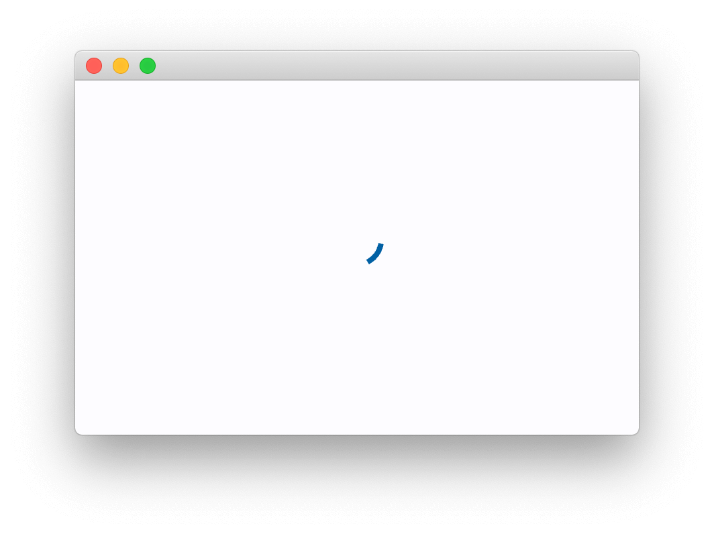
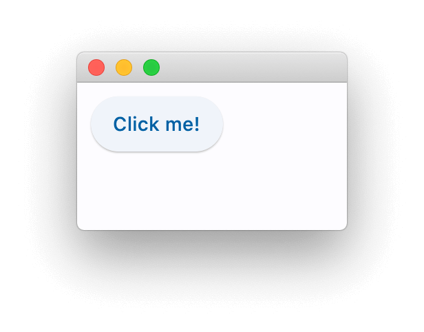
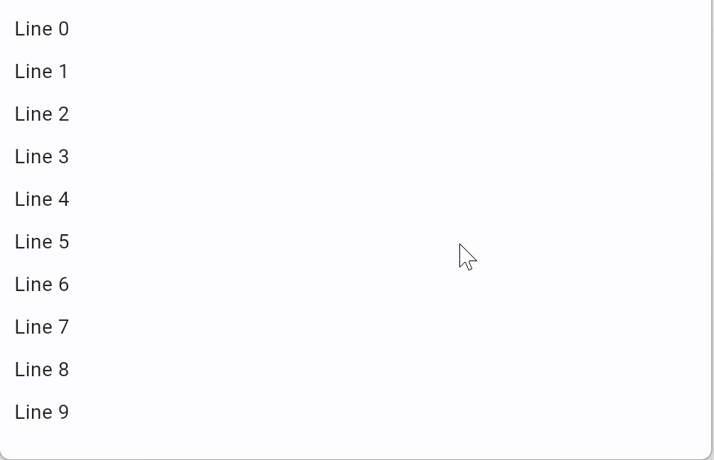
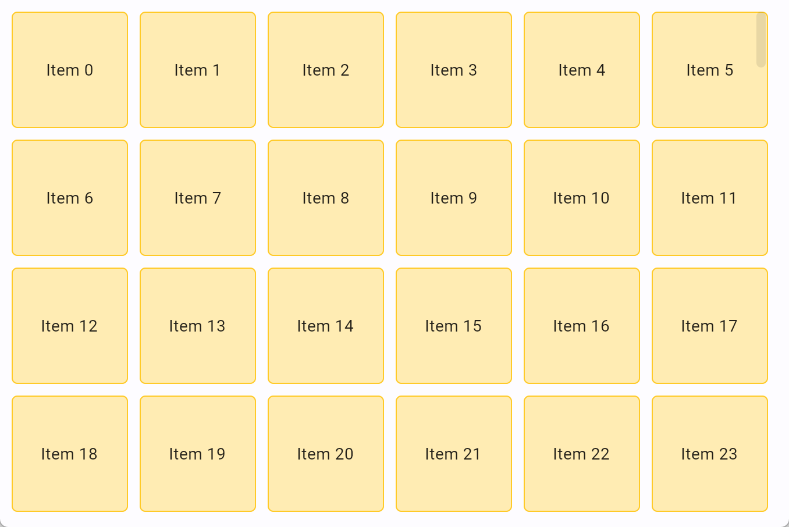
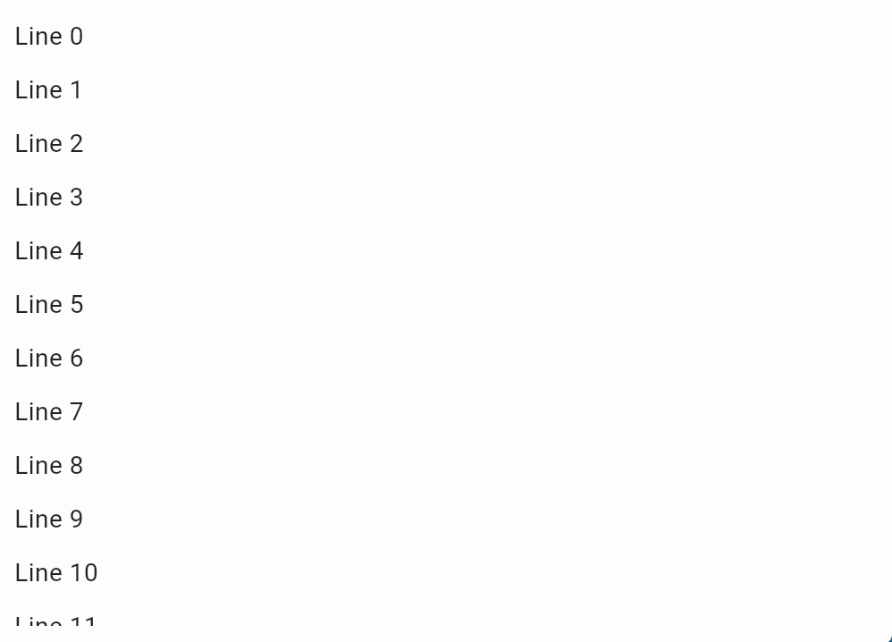
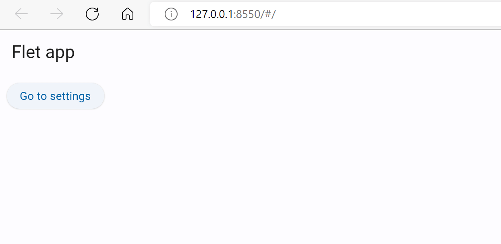
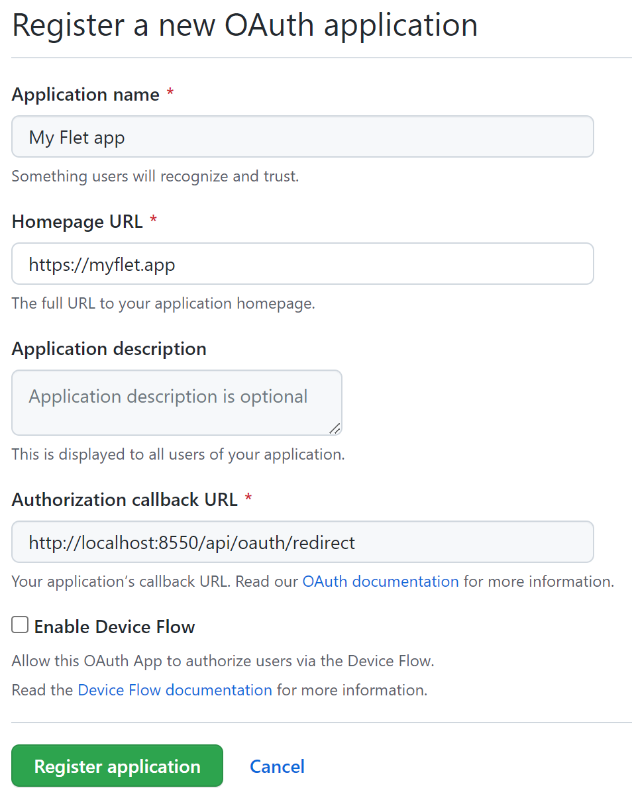
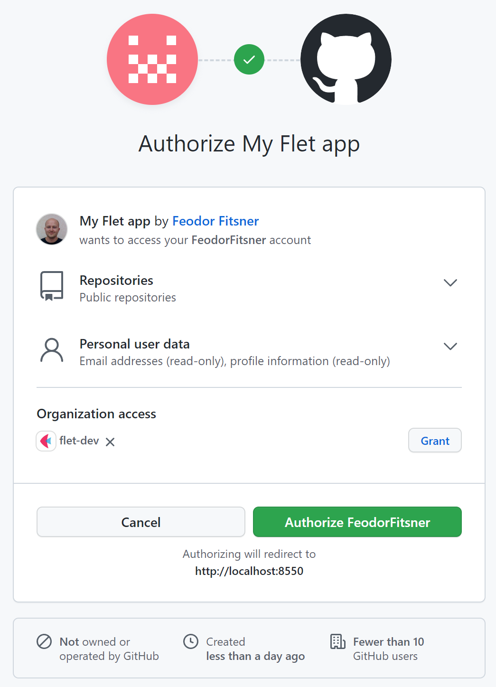
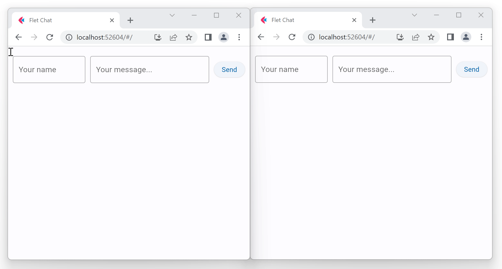
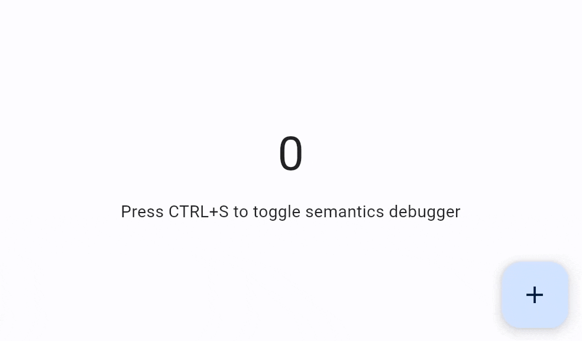

# Глава 1. Введение

## Что такое Flet?

Flet - это фреймворк, который позволяет создавать интерактивные многопользовательские веб-, настольные и мобильные приложения на  языке Python без предварительного опыта фронтэнд-разработки.

Вы создаете пользовательский интерфейс для своей программы с помощью элементов управления Flet, которые основаны на [Flutter](https://flutter.dev/) от Google. Flet не просто "оборачивает" виджеты Flutter, но добавляет собственное "мнение", комбинируя виджеты меньшего размера, скрывая сложности, внедряя лучшие практики пользовательского интерфейса, применяя разумные значения по умолчанию - все для того, чтобы ваши приложения выглядели круто и профессионально без дополнительных усилий.

## Пример приложения Flet

Вот пример приложения "Счетчик": `counter.py`

```python
import flet as ft

def main(page: ft.Page):
    page.title = "Flet counter example"
    page.vertical_alignment = ft.MainAxisAlignment.CENTER

    txt_number = ft.TextField(value="0", text_align=ft.TextAlign.RIGHT, width=100)

    def minus_click(e):
        txt_number.value = str(int(txt_number.value) - 1)
        page.update()

    def plus_click(e):
        txt_number.value = str(int(txt_number.value) + 1)
        page.update()

    page.add(
        ft.Row(
            [
                ft.IconButton(ft.icons.REMOVE, on_click=minus_click),
                txt_number,
                ft.IconButton(ft.icons.ADD, on_click=plus_click),
            ],
            alignment=ft.MainAxisAlignment.CENTER,
        )
    )

ft.app(target=main)
```

Для запуска приложения установите  модуль `flet`:

```
pip install flet
```

и запустите программу:

```
python counter.py
```

Приложение будет запущено в собственном окне операционной системы - какая приятная альтернатива Electron!


Если вы хотите запустить приложение как веб-приложение, просто замените последнюю строку на:

```python
ft.app(target=main, view=ft.AppView.WEB_BROWSER)
```

запустите еще раз, и теперь вы мгновенно получите веб-приложение:


# Глава 2. Создание Flet-приложений на Python

Чтобы написать Flet-приложение, вам не нужно быть гуру front-end, но рекомендуется обладать базовыми знаниями Python и объектно-ориентированного программирования.

В этом руководстве мы изучим структуру приложения Flet, узнаем, как выводить данные с помощью элементов управления Flet, запрашивать данные у пользователя и создавать базовые макеты страниц. Мы также рассмотрим некоторые варианты упаковки и развертывания, чтобы предоставить пользователям готовое приложение.

## Установка  модуля flet

Для Flet требуется Python версии 3.8 или выше. Чтобы начать с Flet, вам необходимо сначала установить  модуль `flet`:

```
pip install flet
```

> [!info] **ПРИМЕЧАНИЕ**
>
> Для обновления модуля `flet` запустите :
>
> ```
> pip install flet --upgrade
> ```

Чтобы установить предварительную версию Flet (для продвинутых пользователей), запустите:

```
pip install flet --pre
```

> [!warning] **ВНИМАНИЕ**
>
> Рекомендуется устанавливать предварительные сборки в виртуальную среду.

## Базовая структура приложения

Самое минимальное приложение Flet имеет следующую структуру:

```python
import flet as ft

def main(page: ft.Page):
    # add/update controls on Page
    pass

ft.app(target=main)
```



> [!info] **ПРИМЕЧАНИЕ**
>
> Этот раздел намеренно назван "базовым", поскольку позже в этом руководстве мы рассмотрим более реальные подходы к структуре приложения с использованием повторно используемых элементов управления.

Типичная программа Flet заканчивается вызовом`flet.app()`, после чего приложение начинает ожидать новых сеансов пользователя. Функция `main()` - это точка входа в приложение Flet. Оно вызывается в новом потоке для каждого сеанса пользователя с  переданным в него экземпляром `Page`. При запуске Flet-приложения в браузере для каждой открытой вкладки или страницы запускается новый сеанс пользователя. При запуске в качестве настольного приложения создается только один сеанс.

`Page` это как "холст", специфичный для пользователя, визуальное состояние сеанса пользователя. Чтобы создать пользовательский интерфейс приложения, вы добавляете и удаляете элементы управления на страницу, обновляете их свойства. Приведенный выше пример кода будет отображать каждому пользователю только пустую страницу.

По умолчанию приложение Flet запускается в окне операционной системы, что очень удобно для разработки. Однако вы можете открыть его в новом окне браузера, изменив вызов `flet.app` следующим образом:

```python
ft.app(target=main, view=ft.AppView.WEB_BROWSER)
```

> [!info] **ИНФОРМАЦИЯ**
>
> Внутренне каждое приложение Flet является веб-приложением, и даже если оно открыто в окне операционной системы, встроенный веб-сервер все равно запускается в фоновом режиме. Веб-сервер Flet называется "Fletd" и по умолчанию он прослушивает случайный TCP-порт. Вы можете указать пользовательский TCP-порт, а затем открыть приложение в браузере вместе с режимом просмотра на рабочем столе:
>
> ```
> flet.app(port=8550, target=main)
> ```
>
> Откройте `http://localhost:<port>` в своем браузере, чтобы просмотреть веб-версию вашего приложения Flet.

## Элементы управления

Пользовательский интерфейс состоит из **элементов управления** (также известных как виджеты). Чтобы элементы управления были видны пользователю, они должны быть добавлены в `Page` или внутри других элементов управления. Page - самый верхний элемент управления. Вложенные элементы управления друг в друга могут быть представлены в виде дерева с Page в качестве корневого элемента.

Элементы управления - это обычные классы Python. Создавайте экземпляры элементов управления с помощью конструкторов с параметрами, соответствующими их свойствам, например:

```python
t = ft.Text(value="Hello, world!", color="green")
```

Чтобы отобразить элемент управления на странице, добавьте его в `page.controls`  и вызовите `page.update()` для отправки изменений страницы в браузер или настольный клиент:

```python
import flet as ft

def main(page: ft.Page):
    t = ft.Text(value="Hello, world!", color="green")
    page.controls.append(t)
    page.update()

ft.app(target=main)
```


> [!info] **ПРИМЕЧАНИЕ**
>
> В следующих примерах мы будем показывать только содержимое  функции `main`.

Вы можете изменять свойства элемента управления, и пользовательский интерфейс будет обновлен при следующей `page.update()`

```python
t = ft.Text()
page.add(t) # это короткая запись для вызова page.controls.append(t), 
		   # а затем page.update()

for i in range(10):
    t.value = f"Step {i}"
    page.update()
    time.sleep(1
```

Некоторые элементы управления являются "контейнерными" элементами управления (например, `Page`), которые могут содержать другие элементы управления. Например,  элемент управления `Row` позволяет размещать другие элементы управления в строке один за другим:

```python
page.add(
    ft.Row(controls=[
        ft.Text("A"),
        ft.Text("B"),
        ft.Text("C")
    ])
)
```

или `TextField` и `ElevatedButton` рядом:

```python
page.add(
    ft.Row(controls=[
        ft.TextField(label="Your name"),
        ft.ElevatedButton(text="Say my name!")
    ])
)
```

`page.update()` достаточно умен, чтобы отправлять только изменения, внесенные с момента его последнего вызова, поэтому вы можете добавить на страницу пару новых элементов управления, удалить некоторые из них, изменить свойства других элементов управления, а затем вызвать `page.update()` для выполнения пакетного обновления, например:

```python
for i in range(10):
    page.controls.append(ft.Text(f"Line {i}"))
    if i > 4:
        page.controls.pop(0)
    page.update()
    time.sleep(0.3)
```

Некоторые элементы управления, такие как кнопки, могут иметь обработчики событий, реагирующие на ввод данных пользователем, например `ElevatedButton.on_click`:

```python
def button_clicked(e):
    page.add(ft.Text("Clicked!"))

page.add(ft.ElevatedButton(text="Click me", on_click=button_clicked))
```

и более продвинутый пример:

```python
import flet as ft

def main(page):
    def add_clicked(e):
        page.add(ft.Checkbox(label=new_task.value))
        new_task.value = ""
        new_task.focus()
        new_task.update()

    new_task = ft.TextField(hint_text="Whats needs to be done?", width=300)
    page.add(ft.Row([new_task, ft.ElevatedButton("Add", on_click=add_clicked)]))

ft.app(target=main)
```


> [!info] **ИНФОРМАЦИЯ**
>
> Flet реализует *императивную* модель пользовательского интерфейса, в которой вы "вручную" создаете пользовательский интерфейс приложения с элементами управления с отслеживанием состояния, а затем изменяете его, обновляя свойства элемента управления. Flutter реализует *декларативную* модель, в которой пользовательский интерфейс автоматически перестраивается при изменении данных приложения. Управление состоянием приложения в современных интерфейсных приложениях по своей сути является сложной задачей, и "олдскульный" подход Flet мог бы быть более привлекательным для программистов без опыта работы с интерфейсом.

### Свойство `visible` 

Каждый элемент управления имеет свойство `visible` , которое `true` по умолчанию - элемент управления отображается на странице. Установка `visible` значения `false` полностью предотвращает отображение элемента управления (и всех его дочерних элементов, если таковые имеются) на холсте страницы. Скрытые элементы управления нельзя сфокусировать или выбрать с помощью клавиатуры или мыши, и они не генерируют никаких событий.

### Свойство  `disabled`

Каждый элемент управления имеет `disabled` свойство, которое по `false` умолчанию - элемент управления, и все его дочерние элементы включены. `disabled` свойство в основном используется с элементами управления для ввода данных, такими как `TextField`, `Dropdown`, `Checkbox`, кнопки. Однако, `disabled` может быть установлен у родительского элемента управления, и его значение будет рекурсивно передаваться всем дочерним элементам.

Например, если у вас есть форма с элементами управления с несколькими вводами, вы можете установить свойство `disabled`  для каждого элемента управления по отдельности:

```python
first_name = ft.TextField()
last_name = ft.TextField()
first_name.disabled = True
last_name.disabled = True
page.add(first_name, last_name)
```

или вы можете поместить элементы управления формой в контейнер, например, `Column` а затем установить `disabled` для всего столбца:

```python
first_name = ft.TextField()
last_name = ft.TextField()
c = ft.Column(controls=[
    first_name,
    last_name
])
c.disabled = True
page.add(c)
```

## Ссылки на элементы управления

Элементы управления Flet - это объекты, и для доступа к их свойствам нам нужно сохранить ссылки (переменные) на эти объекты.

Рассмотрим следующий пример:

```python
import flet as ft

def main(page):

    first_name = ft.TextField(label="First name", autofocus=True)
    last_name = ft.TextField(label="Last name")
    greetings = ft.Column()

    def btn_click(e):
        greetings.controls.append(ft.Text(f"Hello, {first_name.value} 
                                          		  {last_name.value}!"))
        first_name.value = ""
        last_name.value = ""
        page.update()
        first_name.focus()

    page.add(
        first_name,
        last_name,
        ft.ElevatedButton("Say hello!", on_click=btn_click),
        greetings,
    )
ft.app(target=main)
```


В самом начале `main()` метода мы создаем три элемента управления, которые собираемся использовать в `on_click` обработчике кнопки: два `TextField` для имени и фамилии и `Column` - контейнер для поздравительных сообщений. Мы создаем элементы управления со всеми их заданными свойствами, и в конце `main()` метода, при `page.add()` вызове, мы используем их ссылки (переменные).

Когда добавляется все больше элементов управления и обработчиков событий, становится сложно хранить все определения элементов управления в одном месте, поэтому они становятся разбросанными по `main()` телу. Взглянув на `page.add()` параметры, трудно представить (без постоянного перехода к определениям переменных в IDE), как будет выглядеть конечная форма:

```python
 page.add(
        first_name,
        last_name,
        ft.ElevatedButton("Say hello!", on_click=btn_click),
        greetings,
    )
```

Это `first_name` текстовое поле, установлена ли в нем авто-фокусировка? Приветствие - это `Row` или  `Column`?

Flet предоставляет `Ref` служебный класс, который позволяет определять ссылку на элемент управления, использовать эту ссылку в обработчиках событий и устанавливать ссылку на реальный элемент управления позже, при построении дерева. Идея исходит от [React](https://reactjs.org/docs/refs-and-the-dom.html).

Чтобы определить новую типизированную ссылку на элемент управления:

```python
first_name = ft.Ref[ft.TextField]()
```

Для доступа к элементу управления, на который есть ссылка (control de-reference), используйте `Ref.current` свойство:

```python
# empty first name
first_name.current.value = ""
```

Чтобы назначить управление ссылке, задайте для `Control.ref` свойства ссылку:

```python
page.add(
    ft.TextField(ref=first_name, label="First name", autofocus=True)
)
```

> [!info] **ПРИМЕЧАНИЕ**
>
> Все элементы управления Flet имеют `ref` свойство.

Мы могли бы переписать нашу программу, чтобы использовать ссылки:

```python
import flet as ft


def main(page):

    first_name = ft.Ref[ft.TextField]()
    last_name = ft.Ref[ft.TextField]()
    greetings = ft.Ref[ft.Column]()

    def btn_click(e):
        greetings.current.controls.append(
            ft.Text(f"Hello, {first_name.current.value} {last_name.current.value}!")
        )
        first_name.current.value = ""
        last_name.current.value = ""
        page.update()
        first_name.current.focus()

    page.add(
        ft.TextField(ref=first_name, label="First name", autofocus=True),
        ft.TextField(ref=last_name, label="Last name"),
        ft.ElevatedButton("Say hello!", on_click=btn_click),
        ft.Column(ref=greetings),
    )

ft.app(target=main)
```


Теперь мы можем четко видеть в `page.add()` структуру страницы и все элементы управления, из которых она построена.

Да, логика становится немного более подробной, поскольку вам нужно добавить `.current.` для доступа к элементу управления ref, но это вопрос личных предпочтений :)

# Глава 3. Получение данных от пользователя

Создание интерактивных веб-приложений с помощью Flet - это проще простого!

## Кнопка (Button)

`Button` это наиболее важный элемент управления вводом, который генерирует `click` событие при нажатии:

```python
btn = ft.ElevatedButton("Click me!")
page.add(btn)
```



Все события, генерируемые элементами управления на веб-странице, постоянно отправляются обратно в ваш скрипт, так как же вы реагируете на нажатие кнопки?

## Обработчики событий

 	Кнопки с событиями в приложении "Счетчик":

```python
import flet as ft

def main(page: ft.Page):
    page.title = "Flet counter example"
    page.vertical_alignment = ft.MainAxisAlignment.CENTER

    txt_number = ft.TextField(value="0", text_align="right", width=100)

    def minus_click(e):
        txt_number.value = str(int(txt_number.value) - 1)
        page.update()

    def plus_click(e):
        txt_number.value = str(int(txt_number.value) + 1)
        page.update()

    page.add(
        ft.Row(
            [
                ft.IconButton(ft.icons.REMOVE, on_click=minus_click),
                txt_number,
                ft.IconButton(ft.icons.ADD, on_click=plus_click),
            ],
            alignment=ft.MainAxisAlignment.CENTER,
        )
    )

ft.app(target=main)
```


## Текстовое поле (Textbox )

Flet предоставляет ряд элементов управления для построения форм: TextField], Checkbox, Dropdown, ElevatedButton.

Давайте спросим имя пользователя:

```python
import flet as ft

def main(page: ft.Page):
    page.title = "Flet counter example"
    page.vertical_alignment = ft.MainAxisAlignment.CENTER

    txt_number = ft.TextField(value="0", text_align="right", width=100)

    def minus_click(e):
        txt_number.value = str(int(txt_number.value) - 1)
        page.update()

    def plus_click(e):
        txt_number.value = str(int(txt_number.value) + 1)
        page.update()

    page.add(
        ft.Row(
            [
                ft.IconButton(ft.icons.REMOVE, on_click=minus_click),
                txt_number,
                ft.IconButton(ft.icons.ADD, on_click=plus_click),
            ],
            alignment=ft.MainAxisAlignment.CENTER,
        )
    )

ft.app(target=main)
```


## Флажок (Checkbox)

Элемент управления Checkbox предоставляет вам различные параметры для отправки свойств и событий для простоты использования.

Давайте создадим задачу с одним флажком:

```python
import flet as ft

def main(page):
    def checkbox_changed(e):
        output_text.value = (
            f"You have learned how to ski :  {todo_check.value}."
        )
        page.update()

    output_text = ft.Text()
    todo_check = ft.Checkbox(label="ToDo: Learn how to use ski", value=False, on_change=checkbox_changed)
    page.add(todo_check, output_text)

ft.app(target=main)
```


## Выпадающий список (Dropdown)

```python
import flet as ft


def main(page: ft.Page):
    def button_clicked(e):
        output_text.value = f"Dropdown value is:  {color_dropdown.value}"
        page.update()

    output_text = ft.Text()
    submit_btn = ft.ElevatedButton(text="Submit", on_click=button_clicked)
    color_dropdown = ft.Dropdown(
        width=100,
        options=[
            ft.dropdown.Option("Red"),
            ft.dropdown.Option("Green"),
            ft.dropdown.Option("Blue"),
        ],
    )
    page.add(color_dropdown, submit_btn, output_text)

ft.app(target=main)
```


# Глава 4.  Сочетания клавиш

Надежная поддержка клавиатуры является ключом к повышению производительности пользователя при использовании веб-сайта и, особенно, настольного приложения. Действительно, постоянное переключение между мышью и клавиатурой может быть действительно раздражающим.

В дополнение к `.autofocus` свойству и `TextField.focus()` методу элементов управления формой Flet позволяет обрабатывать "глобальные" события клавиатуры.

Чтобы фиксировать все нажатия клавиш, реализуйте `page.on_keyboard_event` обработчик. Параметр обработчика событий является экземпляром `e` класса со следующими свойствами:`KeyboardEvent`

- `key` - текстовое представление нажатой клавиши, например, `A`, `Enter` или `F5`.
- `shift` - `True` если нажата клавиша "Shift".
- `ctrl` - `True` если нажата клавиша "Control".
- `alt` - `True` если нажата клавиша "Alt" ("Option").
- `meta` - `True` если нажата клавиша "Command".

```python
import flet as ft  
  
def main(page: ft.Page):  
def on_keyboard(e: ft.KeyboardEvent):  
page.add(  
ft.Text(  
f"Key: {e.key}, Shift: {e.shift}, Control: {e.ctrl}, Alt: {e.alt}, Meta: {e.meta}"  
)  
)  
  
page.on_keyboard_event = on_keyboard  
page.add(  
ft.Text("Press any key with a combination of CTRL, ALT, SHIFT and META keys...")  
)  
  
ft.app(target=main)
```


# Глава 5. Цвета


## Значение цвета

Существует 2 способа определить значение свойства color в Flet: шестнадцатеричное значение и именованные цвета.

### Шестнадцатеричное значение

Шестнадцатеричное значение должно быть в формате `#aarrggbb` (`0xaarrggbb`) или `#rrggbb` (`0xeeggbb`). В случае, если параметр `aa` (непрозрачность) опущен, для него устанавливается значение `ff` (непрозрачный).

```
c1 = ft.Container(bgcolor='#ff0000')
```

### Именованные цвета

Именованные цвета - это цвета темы оформления материалов и палитры цветов. Их можно задать с помощью строкового значения или с помощью модуля flet.colors.

```
c1 = ft.Container(bgcolor=ft.colors.YELLOW)  
c2 = ft.Container(bgcolor='yellow')
```

#### Тематические цвета


В `theme.color_scheme` есть 30 именованных цветов темы, которые генерируются на основе свойства `color_scheme_seed`. Начальное значение цвета по умолчанию - "синий" (blue).

```python
# example for generating page theme colors based on the seed color  
page.theme = theme.Theme(color_scheme_seed='green')  
page.update()
```

Любой из 30 цветов может быть переопределен, и в этом случае они будут иметь абсолютное значение, которое не будет зависеть от начального цвета.

```python
page.theme = ft.Theme(
    color_scheme=ft.ColorScheme(
        primary=ft.colors.GREEN,
        primary_container=ft.colors.GREEN_200
        # ...
    ),
)
```


Цвета темы определяют резервные цвета для большинства элементов управления Flet.

#### Цветовые палитры


Первоначально созданные Material Design в 2014 году, цветовые палитры состоят из цветов, разработанных для гармоничного сочетания.

Образцы цветов (палитры) состоят из различных оттенков определенного цвета. Большинство образцов имеют оттенки от `100` до `900` с шагом в сто плюс цвет `50`. Чем меньше число, тем бледнее цвет. Чем больше число, тем темнее цвет. Образцы акцентов (например, `redAccent`) имеют только значения `100`, `200`, `400` и `700`.

Кроме того, доступна серия черных и белых цветов с обычной непрозрачностью. Например, `black54` - это чистый черный цвет с 54% непрозрачностью.

Цвета палитры можно использовать для настройки свойств цвета отдельных элементов управления или в качестве начального цвета для создания цветов темы.

## Непрозрачность цвета

Вы можете указать непрозрачность для любого цвета (шестнадцатеричное значение или именованный), используя `with_opacity` метод. Значение непрозрачности должно быть между `0.0` (полностью прозрачный) и `1.0` (непрозрачный).

```python
color = ft.colors.with_opacity(0.5, ft.colors.PRIMARY)
color = ft.colors.with_opacity(0.5, '#ff6666')
```

Другой способ указать непрозрачность для строкового значения:

```python
color = "surface,0.5"
```

Для шестнадцатеричного значения вы можете указать `aa` канал со значениями между `00` и `ff`, например:

```python
color = "#7fff6666"
```

## Определение цветов для элементов управления Flet

Большинство элементов управления Flet имеют цвета по умолчанию, определенные `color_scheme` которые могут быть переопределены на разных уровнях.


### Уровень элемента управления

Если цвет определен на уровне управления, он будет использоваться.

```python
c = ft.Container(width=100, height=100, bgcolor=ft.colors.GREEN_200)
```

Не у каждого элемента управления Flet есть свойство color, которое можно установить на уровне элемента управления. Например, `FilledButton` всегда имеет "основной" цвет по умолчанию, определяемый цветом ближайшего предка `theme`.

### Уровень темы элемента управления

Для `ScrollBar` (используется в элементах управления с возможностью прокрутки: `Page`, `View`, `Column`, `Row` `ListView`, `GridView`), элементов `Tabs` и `Text`, Flet проверит, есть ли в теме ближайшего "предка"  тема полосы прокрутки  (ScrollBar Theme), тема вкладок (ScrollBar  Theme) или тема текста (Text  Theme).

> [!info] ПРИМЕЧАНИЕ
>Если вам нужно изменить тему для определенного элемента управления полосой прокрутки, текстом или вкладками, вы можете поместить этот элемент управления в контейнер и настроить `scrollbar_theme`, `text_theme` или `tabs_theme` для этого контейнера `theme`.

### Уровень темы

Flet проверит наличие ближайшего предка, который `theme` определил, и возьмет цвет из `ColorScheme`. В приведенном ниже примере ближайшим параметром для `FilledButton` является `Container`, а `primary` цвет, который используется для кнопки, будет взят из `theme` цвета контейнера.

```python
import flet as ft

def main(page: ft.Page):          
    
    container = ft.Container(
        width=200,
        height=200,
        border=ft.border.all(1, ft.colors.BLACK),
        content=ft.FilledButton("Primary color"),
        theme=ft.Theme(color_scheme=ft.ColorScheme(primary=ft.colors.YELLOW)))
    
    page.add(container)

ft.app(target=main)   
```

Если свойство color элемента управления, тема для конкретного элемента управления или тема ближайшего предка не указаны, ближайшим предком будет страница, и будут использоваться цвета со страницы по умолчанию `color_scheme`.

#  Глава 6. Большие списки

В большинстве случаев вы можете использовать элементы управления `Column` и `Row` для отображения списков, но если список содержит сотни или тысячи элементов, `Column` и `Row` будут неэффективны, поскольку они отображают все элементы сразу, даже если они не видны при текущей позиции прокрутки.

В следующем примере мы добавляем 5000 текстовых элементов управления на страницу. Страница использует `Column` в качестве контейнера компоновки:

```python
import flet as ft

def main(page: ft.Page):
    for i in range(5000):
        page.controls.append(ft.Text(f"Line {i}"))
    page.scroll = "always"
    page.update()

ft.app(target=main, view=ft.AppView.WEB_BROWSER)
```

Запустите программу и обратите внимание, что первоначальная загрузка и отрисовка всех строк текста на странице занимает не только пару секунд, но и прокрутка происходит медленно и с задержками:


Для отображения списков с большим количеством элементов используйте элементы управления `ListView` и `GridView`, которые отображают элементы по запросу, видимые только в текущей позиции прокрутки.

## ListView

`ListView` могут быть вертикальными (по умолчанию) или горизонтальными. Элементы ListView отображаются один за другим в направлении прокрутки.

ListView уже реализует эффективное отображение своих дочерних элементов по запросу, но производительность прокрутки можно было бы еще больше улучшить, если бы вы могли установить одинаковую фиксированную высоту или ширину (для `horizontal` ListView) для всех элементов ("extent"). Это можно  сделать, либо установив абсолютный extent с помощью  свойства `item_extent`, либо сделав extent всех дочерних элементов равным extent первого дочернего элемента, установив `first_item_prototype` значение `True`.

Давайте выведем список из 5000 элементов, используя элемент управления ListView:

```python
import flet as ft  
  
def main(page: ft.Page):  
lv = ft.ListView(expand=True, spacing=10)  
for i in range(5000):  
lv.controls.append(ft.Text(f"Line {i}"))  
page.add(lv)  
  
ft.app(target=main, view=ft.AppView.WEB_BROWSER)
```

Теперь прокрутка происходит плавно и достаточно быстро, что можно проследить за движениями мыши:



> [!info] ПРИМЕЧАНИЕ
> Мы использовали `expand=True` в конструкторе ListView . Для правильной работы в ListView должна быть указана высота (или ширина, если `horizontal`). Вы могли бы задать абсолютный размер, например, `ListView(height=300, spacing=10)`, но в приведенном выше примере мы создаем ListView таким образом, чтобы он занимал все доступное пространство на странице, то есть расширялся.

## GridView

`GridView` позволяет упорядочивать элементы управления в виде прокручиваемой сетки.

Вы можете создать "сетку" с помощью `ft.Column(wrap=True)` или `ft.Row(wrap=True)`, например:

```python
import os
import flet as ft

os.environ["FLET_WS_MAX_MESSAGE_SIZE"] = "8000000"

def main(page: ft.Page):
    r = ft.Row(wrap=True, scroll="always", expand=True)
    page.add(r)

    for i in range(5000):
        r.controls.append(
            ft.Container(
                ft.Text(f"Item {i}"),
                width=100,
                height=100,
                alignment=ft.alignment.center,
                bgcolor=ft.colors.AMBER_100,
                border=ft.border.all(1, ft.colors.AMBER_400),
                border_radius=ft.border_radius.all(5),
            )
        )
    page.update()

ft.app(target=main, view=ft.AppView.WEB_BROWSER)
```



Попробуйте прокрутить и изменить размер окна браузера - все работает, но сильно лагает.

>[!info] ПРИМЕЧАНИЕ
>При запуске программы мы устанавливаем значение `FLET_WS_MAX_MESSAGE_SIZE` переменной окружения равным `8000000` - это максимальный размер сообщения WebSocket в байтах, который может быть получен сервером Flet, отрисовывающим страницу. Размер по умолчанию равен 1 МБ, но размер сообщения JSON, описывающего 5000 элементов управления контейнером, превысит 1 МБ, поэтому мы увеличиваем допустимый размер до 8 МБ.
Пропускать большие сообщения через канал WebSocket, как правило, не очень хорошая идея, поэтому используйте **[[#batched_updates]]** для управления загрузкой канала.

GridView, похожий на ListView, очень эффективен для отображения большого количества дочерних элементов. Давайте реализуем приведенный выше пример с помощью GridView:

```python
import os
import flet as ft

os.environ["FLET_WS_MAX_MESSAGE_SIZE"] = "8000000"

def main(page: ft.Page):
    gv = ft.GridView(expand=True, max_extent=150, child_aspect_ratio=1)
    page.add(gv)

    for i in range(5000):
        gv.controls.append(
            ft.Container(
                ft.Text(f"Item {i}"),
                alignment=ft.alignment.center,
                bgcolor=ft.colors.AMBER_100,
                border=ft.border.all(1, ft.colors.AMBER_400),
                border_radius=ft.border_radius.all(5),
            )
        )
    page.update()

ft.app(target=main, view=ft.AppView.WEB_BROWSER)
```


Прокрутка в режиме GridView и изменение размера окна выполняются плавно и отзывчиво!

Вы можете указать либо фиксированное количество строк или столбцов (прогонов) с помощью `runs_count` свойства, либо максимальный размер "листа" с помощью `max_extent` свойства, поэтому количество прогонов может изменяться автоматически. В нашем примере мы установили максимальный размер плитки равным 150 пикселям и задали ее форму "квадрат" с помощью `child_aspect_ratio=1`. `child_aspect_ratio` - отношение поперечной оси к "extent" главной оси каждого дочернего элемента. Попробуйте изменить его на `0.5` или `2`.

## batched_updates

При вызове `page.update()` на сервер Flet через WebSockets отправляется сообщение, содержащее обновления страницы с момента последнего вызова `page.update()`. Отправка большого сообщения с тысячами добавленных элементов управления может заставить пользователя ждать несколько секунд, пока сообщения будут полностью получены и элементы управления отрисованы.

Чтобы повысить удобство использования вашей программы и как можно скорее представить результаты пользователю, вы можете отправлять обновления страницы пакетами. Например, следующая программа добавляет 5100 дочерних элементов управления в ListView пакетами по 500 элементов:

```python
import flet as ft

def main(page: ft.Page):

    # add ListView to a page first
    lv = ft.ListView(expand=1, spacing=10, item_extent=50)
    page.add(lv)

    for i in range(5100):
        lv.controls.append(ft.Text(f"Line {i}"))
        # send page to a page
        if i % 500 == 0:
            page.update()
    # send the rest to a page
    page.update()

ft.app(target=main, view=ft.AppView.WEB_BROWSER)
```



# Глава 7. Перетаскивание (drag&drop)

Механика перетаскивания в Flet довольно проста - пользователь начинает перетаскивать `Draggable` элемент управления и "опускает" его на `DragTarget`. Если и перетаскиваемый объект, и цель перетаскивания имеют одинаковое значение, то `group` цель перетаскивания вызовет `on_accept` обработчик события и передаст идентификатор перетаскиваемого элемента управления в качестве данных события. В этом случае draggable служит источником "данных" для операции перетаскивания.

Давайте посмотрим на следующий пример. В приведенной ниже программе вы можете перетащить левый элемент управления, отображающий "1", поверх правого элемента управления, отображающего "0", и когда операция перетаскивания завершится, левый элемент управления заменится на "0", а правый элемент управления станет "1".:

```python
import flet as ft

def main(page: ft.Page):
    page.title = "Drag and Drop example"

    def drag_accept(e):
        # get draggable (source) control by its ID
        src = page.get_control(e.src_id)
        # update text inside draggable control
        src.content.content.value = "0"
        # update text inside drag target control
        e.control.content.content.value = "1"
        page.update()

    page.add(
        ft.Row(
            [
                ft.Draggable(
                    group="number",
                    content=ft.Container(
                        width=50,
                        height=50,
                        bgcolor=ft.colors.CYAN_200,
                        border_radius=5,
                        content=ft.Text("1", size=20),
                        alignment=ft.alignment.center,
                    ),
                ),
                ft.Container(width=100),
                ft.DragTarget(
                    group="number",
                    content=ft.Container(
                        width=50,
                        height=50,
                        bgcolor=ft.colors.PINK_200,
                        border_radius=5,
                        content=ft.Text("0", size=20),
                        alignment=ft.alignment.center,
                    ),
                    on_accept=drag_accept,
                ),
            ]
        )
    )

ft.app(target=main)
```


Итак, разработчик несет ответственность за определение того, что происходит с элементами управления "source" (перетаскиваемый) и "destination" (целевой объект перетаскивания), когда `on_accept` происходит событие.

>[!info] ПОПРОБУЙТЕ
>Измените свойство группы DragTarget на `number1` и обратите внимание, `on_accept` что оно больше не вызывается, когда вы добавляете "1" к цели.

Существуют дополнительные свойства и обработчики событий, которые делают операцию перетаскивания еще более интерактивной. Например, у draggable есть `content_when_dragging` свойство отображать другой элемент управления вместо `content` того, когда выполняется операция перетаскивания. Также есть `content_feedback` свойство отображать другой элемент управления под указателем. По умолчанию под курсором при перетаскивании отображается тот же `content` элемент управления, но с 50% непрозрачностью.

Давайте изменим Draggable в нашем примере, чтобы отображать "дыру" вместо перетаскиваемого элемента управления и просто "1" под курсором при перетаскивании:

```python
...
                ft.Draggable(
                    group="number",
                    content=ft.Container(
                        width=50,
                        height=50,
                        bgcolor=ft.colors.CYAN_200,
                        border_radius=5,
                        content=ft.Text("1", size=20),
                        alignment=ft.alignment.center,
                    ),
                    content_when_dragging=ft.Container(
                        width=50,
                        height=50,
                        bgcolor=ft.colors.BLUE_GREY_200,
                        border_radius=5,
                    ),
                    content_feedback=ft.Text("1"),
                ),
...
```


В элементе управления целью перетаскивания дополнительно есть `on_will_accept` и `on_leave` обработчики событий, которые помогают лучше визуализировать, когда настало подходящее время "уронить" что-либо на цель. Давайте изменим DragTarget в нашем примере, чтобы нарисовать границу вокруг целевого элемента управления, когда он будет готов принять входящее перетаскивание:

```python
import flet as ft

def main(page: ft.Page):
    page.title = "Drag and Drop example 2"

    def drag_accept(e):
        # get draggable (source) control by its ID
        src = page.get_control(e.src_id)
        # update text inside draggable control
        src.content.content.value = "0"
        # reset source group, so it cannot be dropped to a target anymore
        src.group = ""
        # update text inside drag target control
        e.control.content.content.value = "1"
        # reset border
        e.control.content.border = None
        page.update()

    def drag_will_accept(e):
        # black border when it's allowed to drop and red when it's not
        e.control.content.border = ft.border.all(
            2, ft.colors.BLACK45 if e.data == "true" else ft.colors.RED
        )
        e.control.update()

    def drag_leave(e):
        e.control.content.border = None
        e.control.update()

    page.add(
        ft.Row(
            [
                ft.Draggable(
                    group="number",
                    content=ft.Container(
                        width=50,
                        height=50,
                        bgcolor=ft.colors.CYAN_200,
                        border_radius=5,
                        content=ft.Text("1", size=20),
                        alignment=ft.alignment.center,
                    ),
                    content_when_dragging=ft.Container(
                        width=50,
                        height=50,
                        bgcolor=ft.colors.BLUE_GREY_200,
                        border_radius=5,
                    ),
                    content_feedback=ft.Text("1"),
                ),
                ft.Container(width=100),
                ft.DragTarget(
                    group="number",
                    content=ft.Container(
                        width=50,
                        height=50,
                        bgcolor=ft.colors.PINK_200,
                        border_radius=5,
                        content=ft.Text("0", size=20),
                        alignment=ft.alignment.center,
                    ),
                    on_accept=drag_accept,
                    on_will_accept=drag_will_accept,
                    on_leave=drag_leave,
                ),
            ]
        )
    )

ft.app(target=main)
```


# Глава 8. Навигация и маршрутизация

Навигация и маршрутизация - важная функция одностраничных приложений (SPA), которая позволяет организовать пользовательский интерфейс приложения в виде виртуальных страниц (**View**) и "перемещаться" между ними, в то время как URL приложения отражает текущее состояние приложения.

В мобильных приложениях навигация и маршрутизация служат для [глубокой привязки](https://docs.flutter.dev/development/ui/navigation/deep-linking) к конкретным частям приложения.

Что ж, потребовалось [больше усилий](https://github.com/flet-dev/flet/pull/95/files), чем ожидалось, чтобы добавить навигацию и маршрутизацию во Flet, поскольку реализация основана на [Navigator 2.0](https://medium.com/flutter/learning-flutters-new-navigation-and-routing-system-7c9068155ade) Flutter API и требуется заменить абстракцию во Flet "**Page**"  на "**Page** и **View**". Новый API навигации и маршрутизации Flutter имеет существенные улучшения, такие как:

1. Программный контроль над стеком истории.
2. Простой способ перехватить вызов кнопки "Назад" на панели приложений.
3. Надежная синхронизация с историей браузера.



Код: 

```python
import flet
from flet import AppBar, ElevatedButton, Page, Text, View, colors


def main(page: Page):
    page.title = "Routes Example"

    print("Initial route:", page.route)

    def route_change(e):
        print("Route change:", e.route)
        page.views.clear()
        page.views.append(
            View(
                "/",
                [
                    AppBar(title=Text("Flet app")),
                    ElevatedButton("Go to settings", on_click=open_settings),
                ],
            )
        )
        if page.route == "/settings" or page.route == "/settings/mail":
            page.views.append(
                View(
                    "/settings",
                    [
                        AppBar(title=Text("Settings"), bgcolor=colors.SURFACE_VARIANT),
                        Text("Settings!", style="bodyMedium"),
                        ElevatedButton(
                            "Go to mail settings", on_click=open_mail_settings
                        ),
                    ],
                )
            )
        if page.route == "/settings/mail":
            page.views.append(
                View(
                    "/settings/mail",
                    [
                        AppBar(
                            title=Text("Mail Settings"), bgcolor=colors.SURFACE_VARIANT
                        ),
                        Text("Mail settings!"),
                    ],
                )
            )
        page.update()

    def view_pop(e):
        print("View pop:", e.view)
        page.views.pop()
        top_view = page.views[-1]
        page.go(top_view.route)

    page.on_route_change = route_change
    page.on_view_pop = view_pop

    def open_mail_settings(e):
        page.go("/settings/mail")

    def open_settings(e):
        page.go("/settings")

    page.go(page.route)


flet.app(target=main, view=flet.WEB_BROWSER)
```

##  Маршрут страницы (Page route)

Маршрут страницы - это часть URL-адреса приложения после символа `#`:


Маршрут приложения по умолчанию, если он не задан пользователем в URL приложения, является `/`. Все маршруты начинаются с `/`, например `/store`, `/authors/1/books/2`.

Маршрут приложения можно получить, прочитав свойство `page.route` , например:

```python
import flet as ft

def main(page: ft.Page):
    page.add(ft.Text(f"Initial route: {page.route}"))

ft.app(target=main, view=ft.AppView.WEB_BROWSER)
```

Скопируйте URL приложения, откройте новую вкладку браузера, вставьте URL, измените его часть после `#` на `/test` и нажмите enter. Вы должны увидеть "Initial route: / test".

Каждый раз, когда маршрут в URL изменяется (путем редактирования URL или просмотра истории браузера с помощью кнопок Назад / вперед) Flet вызывает `page.on_route_change` обработчик событий:

```python
import flet as ft

def main(page: ft.Page):
    page.add(ft.Text(f"Initial route: {page.route}"))

    def route_change(e: ft.RouteChangeEvent):
        page.add(ft.Text(f"New route: {e.route}"))

    page.on_route_change = route_change
    page.update()

ft.app(target=main, view=ft.AppView.WEB_BROWSER)
```

Теперь попробуйте несколько раз обновить хэш URL-адреса, а затем используйте кнопки Назад / Вперед! Вы должны видеть новое сообщение, добавляемое на страницу каждый раз, когда меняется маршрут:


Маршрут может быть изменен программно, путем обновления свойства `page.route` :

```python
import flet as ft

def main(page: ft.Page):
    page.add(ft.Text(f"Initial route: {page.route}"))

    def route_change(e: ft.RouteChangeEvent):
        page.add(ft.Text(f"New route: {e.route}"))

    def go_store(e):
        page.route = "/store"
        page.update()

    page.on_route_change = route_change
    page.add(ft.ElevatedButton("Go to Store", on_click=go_store))

ft.app(target=main, view=ft.AppView.WEB_BROWSER)
```

Нажмите кнопку "Go to Store", и вы увидите, что URL приложения изменен, а новый элемент добавлен в историю браузера. Вы можете использовать кнопку браузера "Назад", чтобы перейти к предыдущему маршруту.

## Представления (View)

Страница (Page) во Flet теперь представляет собой не просто отдельную страницу, а контейнер для одного или нескольких представлений (View), наложенных друг на друга, как сэндвич:


Коллекция из этих представлений составляет историю навигации. Страница имеет  свойство `page.views`  для доступа к коллекции представлений.

Последние представление в списке - это то, которое в данный момент отображается на странице. Список представлений должен содержать хотя бы один элемент (корневое представления).

Чтобы имитировать переход между страницами, измените `page.route` и добавьте новую `View` в конце `page.view` списка.

Извлеките последнее представление из коллекции и измените маршрут на "предыдущий" в обработчике событий  `page.on_view_pop` , чтобы вернуться назад.

## Построение представлений при изменении маршрута

Для построения надежной навигации в программе должно быть единственное место, которое создает список представлений в зависимости от текущего маршрута. Другими словами, стек истории навигации (представленный списком представлений) должен быть функцией маршрута.

Этим местом является обработчик событий `page.on_route_change.

Давайте сведем все воедино в законченный пример, который позволяет перемещаться между двумя страницами:

```python
import flet as ft

def main(page: ft.Page):
    page.title = "Routes Example"

    def route_change(route):
        page.views.clear()
        page.views.append(
            ft.View(
                "/",
                [
                    ft.AppBar(title=ft.Text("Flet app"), bgcolor=ft.colors.SURFACE_VARIANT),
                    ft.ElevatedButton("Visit Store", on_click=lambda _: page.go("/store")),
                ],
            )
        )
        if page.route == "/store":
            page.views.append(
                ft.View(
                    "/store",
                    [
                        ft.AppBar(title=ft.Text("Store"), bgcolor=ft.colors.SURFACE_VARIANT),
                        ft.ElevatedButton("Go Home", on_click=lambda _: page.go("/")),
                    ],
                )
            )
        page.update()

    def view_pop(view):
        page.views.pop()
        top_view = page.views[-1]
        page.go(top_view.route)

    page.on_route_change = route_change
    page.on_view_pop = view_pop
    page.go(page.route)


ft.app(target=main, view=ft.AppView.WEB_BROWSER)
```

Попробуйте перемещаться между страницами с помощью кнопок "Visit Store" и "Go Home", кнопок браузера назад / вперед, вручную изменяя маршрут в URL-адресе - это работает, несмотря ни на что! :)

>[!info] ПРИМЕЧАНИЕ
>Для "навигации" между страницами мы использовали  вспомогательный метод  `page.go(route)`, который обновляет `page.route`, вызывает  обработчик событий `page.on_route_change`  для обновления представлений и, наконец, вызывает `page.update()`.

Обратите внимание на использование обработчика событий  `page.on_view_pop` . Он срабатывает, когда пользователь автоматически нажимает кнопку "Назад" в `AppBar` панели управления. В обработчике мы удаляем последний элемент из коллекции представлений и переходим к корневому представлению "под" ним.

## Шаблоны маршрутов

Flet предлагает `TemplateRoute` - служебный класс, основанный на библиотеке [repath](https://github.com/nickcoutsos/python-repath), который позволяет сопоставлять маршруты, подобные ExpressJS, и анализировать их параметры, например `/account/:account_id/orders/:order_id`.

`TemplateRoute` отлично работает с событием изменения маршрута:

```python
troute = TemplateRoute(page.route)

if troute.match("/books/:id"):
    print("Book view ID:", troute.id)
elif troute.match("/account/:account_id/orders/:order_id"):
    print("Account:", troute.account_id, "Order:", troute.order_id)
else:
    print("Unknown route")
```

Подробнее о синтаксисе шаблона, поддерживаемом `repath` библиотекой, можно прочитать здесь [https://github.com/nickcoutsos/python-repath#parameters](https://github.com/nickcoutsos/python-repath#parameters).

## Стратегия URL

Веб-приложения Flet поддерживают два способа настройки маршрутизации на основе URL:

- **Путь** (**path**) (по умолчанию) - пути считываются и записываются без хэша. Например, `fletapp.dev/path/to/view`.
- **Хэш** (**hash**) - пути считываются и записываются в [фрагмент хэша](https://en.wikipedia.org/wiki/Uniform_Resource_Locator#Syntax). Например, `fletapp.dev/#/path/to/view`.
- 
Чтобы изменить стратегию URL, используйте параметр `route_url_strategy`  метода `flet.app()` , например:

```python
ft.app(target=main, route_url_strategy="hash")
```

Стратегия URL для Flet-сервера может быть настроена с помощью переменной окружения  `FLET_ROUTE_URL_STRATEGY` , которая может быть установлена либо `path` (по умолчанию), либо `hash`.

# Глава 8.  Выбор файлов и их загрузка

Элемент управления `FilePicker` открывает собственное диалоговое окно операционной системы для выбора файлов и каталогов.

Работает на всех платформах: Web, macOS, Window, Linux, iOS и Android.


Код:

```python
import flet
from flet import (
    ElevatedButton,
    FilePicker,
    FilePickerResultEvent,
    Page,
    Row,
    Text,
    icons,
)


def main(page: Page):
    # Pick files dialog
    def pick_files_result(e: FilePickerResultEvent):
        selected_files.value = (
            ", ".join(map(lambda f: f.name, e.files)) if e.files else "Cancelled!"
        )
        selected_files.update()

    pick_files_dialog = FilePicker(on_result=pick_files_result)
    selected_files = Text()

    # Save file dialog
    def save_file_result(e: FilePickerResultEvent):
        save_file_path.value = e.path if e.path else "Cancelled!"
        save_file_path.update()

    save_file_dialog = FilePicker(on_result=save_file_result)
    save_file_path = Text()

    # Open directory dialog
    def get_directory_result(e: FilePickerResultEvent):
        directory_path.value = e.path if e.path else "Cancelled!"
        directory_path.update()

    get_directory_dialog = FilePicker(on_result=get_directory_result)
    directory_path = Text()

    # hide all dialogs in overlay
    page.overlay.extend([pick_files_dialog, save_file_dialog, get_directory_dialog])

    page.add(
        Row(
            [
                ElevatedButton(
                    "Pick files",
                    icon=icons.UPLOAD_FILE,
                    on_click=lambda _: pick_files_dialog.pick_files(
                        allow_multiple=True
                    ),
                ),
                selected_files,
            ]
        ),
        Row(
            [
                ElevatedButton(
                    "Save file",
                    icon=icons.SAVE,
                    on_click=lambda _: save_file_dialog.save_file(),
                    disabled=page.web,
                ),
                save_file_path,
            ]
        ),
        Row(
            [
                ElevatedButton(
                    "Open directory",
                    icon=icons.FOLDER_OPEN,
                    on_click=lambda _: get_directory_dialog.get_directory_path(),
                    disabled=page.web,
                ),
                directory_path,
            ]
        ),
    )


flet.app(target=main)
```

`FilePicker` позволяет открывать три диалоговых окна:

- **Pick files** (Выбрать файлы)- один или несколько, любые файлы или только определенных типов.
- **Save file** (Сохранить файл)- выберите каталог и имя файла.
- **Get directory** (Выбрать директорию) - выберите каталог.

При запуске приложения Flet в браузере доступна только опция "Выбрать файлы", которая используется только для загрузки, поскольку, очевидно, не возвращает полный путь к выбранному файлу.

Где программа выбора файлов действительно хороша, так это в десктопном приложении! Все три диалоговых окна возвращают полные пути к выбранным файлам и каталогам - отличное подспорье для ваших пользователей!

## Использование FilePicker в  приложении

Рекомендуется добавить FilePicker в коллекцию `page.overlay.controls`, чтобы это не повлияло на макет вашего приложения. Несмотря на то, что FilePicker имеет размер 0x0, он по-прежнему рассматривается как элемент управления при установке в `Row` или `Column`.

```python
import flet as ft

file_picker = ft.FilePicker()
page.overlay.append(file_picker)
page.update()
```

Чтобы открыть диалоговое окно FilePicker, вызовите один из трех методов:

- `pick_files()`
- `save_file()`
- `get_directory_path()`

Для этого неплохо подходит Lambda:

```python
ft.ElevatedButton("Choose files...",
    on_click=lambda _: file_picker.pick_files(allow_multiple=True))
```

При закрытии диалогового окна вызывается обработчик событий `FilePicker.on_result` , у которого объект **event**  имеет одно из  следующих свойств:

- `files` - только диалоговое окно "Выбрать файлы", список выбранных файлов или `None` если диалоговое окно было отменено.
- `path` - диалоги "Сохранить файл" и "Выбрать директорию", полный путь к файлу или каталогу или `None` если диалог был отменен.

```python
import flet as ft

def on_dialog_result(e: ft.FilePickerResultEvent):
    print("Selected files:", e.files)
    print("Selected file or directory:", e.path)

file_picker = ft.FilePicker(on_result=on_dialog_result)
```

Последний результат всегда доступен в  свойстве `FilePicker.result`.

## Загрузка файлов

`FilePicker` имеет встроенные возможности загрузки, которые работают на всех платформах и в Интернете.

Чтобы загрузить один или несколько файлов, сначала вам следует вызвать `FilePicker.pick_files()`. Когда файлы выбираются пользователем, они никуда не загружаются автоматически, вместо этого ссылки на них сохраняются в состоянии `FilePicker`.

Чтобы выполнить фактическую загрузку, вы должны вызвать метод `FilePicker.upload()`  и передать список файлов, которые необходимо загрузить, вместе с их URL-адресами для загрузки и методом загрузки (`PUT` или `POST`):

```python
import flet as ft

def upload_files(e):
    upload_list = []
    if file_picker.result != None and file_picker.result.files != None:
        for f in file_picker.result.files:
            upload_list.append(
                FilePickerUploadFile(
                    f.name,
                    upload_url=page.get_upload_url(f.name, 600),
                )
            )
        file_picker.upload(upload_list)

ft.ElevatedButton("Upload", on_click=upload_files)
```


> [!info] **ПРИМЕЧАНИЕ**
>
> Если вам нужно разделить загрузки для каждого пользователя, вы можете указать имя файла с добавлением любого количества каталогов в `page.get_upload_url()` вызове, например:
>
> ```
> upload_url = page.get_upload_url(f"/{username}/pictures/{f.name}", 600)
> ```
> `/{username}/pictures` внутри будут автоматически созданы каталоги, `upload_dir` если они не существуют.

### Хранилище для загрузки

Обратите внимание на использование метода `page.get_upload_url()`  - он генерирует предварительно указанный URL-адрес для загрузки во внутреннее хранилище Flet для загрузки.

>[!info] ИСПОЛЬЗУЙТЕ ЛЮБОЕ ХРАНИЛИЩЕ ДЛЯ ЗАГРУЗКИ ФАЙЛОВ
>Вы можете [сгенерировать предварительно подписанный URL-адрес для загрузки](https://boto3.amazonaws.com/v1/documentation/api/latest/guide/s3-presigned-urls.html#generating-a-presigned-url-to-upload-a-file) для хранилища AWS S3, используя библиотеку boto3.
>Тот же метод должен работать для [Wasabi](https://wasabi.com/), [Backblaze](https://www.backblaze.com/), [MinIO](https://min.io/) и любых других поставщиков хранилищ с S3-совместимым API.

Чтобы включить сохранение загруженных файлов Flet в каталог, укажите полный или относительный путь к этому каталогу в `flet.app()` вызове:

```python
ft.app(target=main, upload_dir="uploads")
```

Вы даже можете поместить загружаемые файлы в каталог "assets", чтобы к загруженным файлам, например, изображениям, документам или другим носителям, можно было сразу получить доступ из клиента Flet:

```python
ft.app(target=main, assets_dir="assets", upload_dir="assets/uploads")
```

и где-нибудь в вашем приложении вы можете отобразить загруженное изображение с помощью:

```python
page.add(ft.Image(src="/uploads/<some-uploaded-picture.png>"))
```

### Ход загрузки

После вызова метода `FilePicker.upload()`  клиент Flet асинхронно начинает загружать выбранные файлы один за другим и сообщает о ходе выполнения через обратный вызов `FilePicker.on_upload` .

Объект события (event) `on_upload`  - это экземпляр класса `FilePickerUploadEvent`  со следующими полями:

- `file_name`
- `progress` - значение от `0.0` до `1.0`.
- `error`

Обратный вызов вызывается как минимум дважды для каждого загруженного файла: с `0` прогрессом перед началом загрузки и с `1.0` прогрессом после завершения загрузки. Для файлов размером более 1 МБ дополнительно сообщается о прогрессе за каждые 10% загруженных файлов.

Пример:

```python
from typing import Dict

import flet
from flet import (
    Column,
    ElevatedButton,
    FilePicker,
    FilePickerResultEvent,
    FilePickerUploadEvent,
    FilePickerUploadFile,
    Page,
    ProgressRing,
    Ref,
    Row,
    Text,
    icons,
)


def main(page: Page):
    prog_bars: Dict[str, ProgressRing] = {}
    files = Ref[Column]()
    upload_button = Ref[ElevatedButton]()

    def file_picker_result(e: FilePickerResultEvent):
        upload_button.current.disabled = True if e.files is None else False
        prog_bars.clear()
        files.current.controls.clear()
        if e.files is not None:
            for f in e.files:
                prog = ProgressRing(value=0, bgcolor="#eeeeee", width=20, height=20)
                prog_bars[f.name] = prog
                files.current.controls.append(Row([prog, Text(f.name)]))
        page.update()

    def on_upload_progress(e: FilePickerUploadEvent):
        prog_bars[e.file_name].value = e.progress
        prog_bars[e.file_name].update()

    file_picker = FilePicker(on_result=file_picker_result, on_upload=on_upload_progress)

    def upload_files(e):
        uf = []
        if file_picker.result is not None and file_picker.result.files is not None:
            for f in file_picker.result.files:
                uf.append(
                    FilePickerUploadFile(
                        f.name,
                        upload_url=page.get_upload_url(f.name, 600),
                    )
                )
            file_picker.upload(uf)

    # hide dialog in a overlay
    page.overlay.append(file_picker)

    page.add(
        ElevatedButton(
            "Select files...",
            icon=icons.FOLDER_OPEN,
            on_click=lambda _: file_picker.pick_files(allow_multiple=True),
        ),
        Column(ref=files),
        ElevatedButton(
            "Upload",
            ref=upload_button,
            icon=icons.UPLOAD,
            on_click=upload_files,
            disabled=True,
        ),
    )


flet.app(target=main, upload_dir="uploads", view=flet.WEB_BROWSER)
```


# Глава 9.  Анимация

## Неявная анимация

С помощью неявной анимации вы можете анимировать свойство элемента управления, задав целевое значение; всякий раз, когда это целевое значение изменяется, элемент управления анимирует свойство со старого значения на новое. Анимация создает интерполированные значения между старым и новым значением в течение заданного _периода времени_. По умолчанию анимация _линейно_ увеличивает значение анимации, однако к анимации может быть применена _кривая_, которая изменяет значение в соответствии с предоставленной кривой. Например, кривая `easeOutCubic`  быстро увеличивает значение анимации в начале анимации, а затем замедляет ее, пока не будет достигнуто целевое значение:

![[curve_ease_out_cubic.gif]]

Каждый из элементов управления предоставляет ряд свойств `animate_{something}` , описанных ниже, для обеспечения неявной анимации его внешнего вида:

- `animate_opacity`
- `animate_rotation`
- `animate_scale`
- `animate_offset`
- `animate_position`
- `animate` (Контейнер)

Свойства `animate_*`  могут иметь одно из следующих значений:

- Экземпляр класса `animation.Animation`  - позволяет настроить продолжительность (в миллисекундах) и кривую анимации, например `animate_rotation=ft.animation.Animation(duration=300, curve="bounceOut")`. Смотрите [Кривые](https://api.flutter.dev/flutter/animation/Curves-class.html) в документах Flutter для получения возможных значений. Значение по умолчанию - `linear`.
- `int` значение - включает анимацию с заданной длительностью в миллисекундах и `linear` кривой.
- `bool` значение - включает анимацию длительностью 1000 миллисекунд и `linear` кривую.

### Анимация непрозрачности

Установка элемента управления `animate_opacity` либо в `True` значение, либо в число, либо в экземпляр класса `animation.Animation`  (см. Выше) включает неявную анимацию свойства `Control.opacity` .


```python
import flet as ft

def main(page: ft.Page):

    c = ft.Container(
        width=150,
        height=150,
        bgcolor="blue",
        border_radius=10,
        animate_opacity=300,
    )

    def animate_opacity(e):
        c.opacity = 0 if c.opacity == 1 else 1
        c.update()

    page.add(
        c,
        ft.ElevatedButton(
            "Animate opacity",
            on_click=animate_opacity,
        ),
    )

ft.app(target=main)
```

### Анимация вращения

Установка элемента управления `animate_rotation` либо в `True` значение, либо в число, либо в экземпляр  класса (см. Выше) `animation.Animation`  включает неявную анимацию свойства `Control.rotate` .


```python
from math import pi
import flet as ft

def main(page: ft.Page):

    c = ft.Container(
        width=100,
        height=70,
        bgcolor="blue",
        border_radius=5,
        rotate=ft.transform.Rotate(0, alignment=ft.alignment.center),
        animate_rotation=ft.animation.Animation(300, ft.AnimationCurve.BOUNCE_OUT),
    )

    def animate(e):
        c.rotate.angle += pi / 2
        page.update()

    page.vertical_alignment = ft.MainAxisAlignment.CENTER
    page.horizontal_alignment = ft.CrossAxisAlignment.CENTER
    page.spacing = 30
    page.add(
        c,
        ft.ElevatedButton("Animate!", on_click=animate),
    )

ft.app(target=main)
```

###  Анимация масштаба

Установка элемента управления `animate_scale` либо в `True` значение, либо в число, либо в экземпляр класса (см. Выше) `animation.Animation`  включает неявную анимацию свойства `Control.scale` .


```python
import flet as ft

def main(page: ft.Page):

    c = ft.Container(
        width=100,
        height=100,
        bgcolor="blue",
        border_radius=5,
        scale=ft.transform.Scale(scale=1),
        animate_scale=ft.animation.Animation(600, ft.AnimationCurve.BOUNCE_OUT),
    )

    def animate(e):
        c.scale = 2
        page.update()

    page.vertical_alignment = ft.MainAxisAlignment.CENTER
    page.horizontal_alignment = ft.CrossAxisAlignment.CENTER
    page.spacing = 30
    page.add(
        c,
        ft.ElevatedButton("Animate!", on_click=animate),
    )

ft.app(target=main)
```

###  Анимация смещения

Установка элемента управления `animate_offset` либо в `True` значение, либо в число, либо в экземпляр класса (см. Выше)  `animation.Animation` включает неявную анимацию свойства `Control.offset` .

Свойство `offset`  - это экземпляр класса `transform.Offset` , который определяет горизонтальное `x` и вертикальное `y` смещение элемента управления, масштабируемого до размера элемента управления. Например, смещение `transform.Offset(-0.25, 0)` приведет к горизонтальному перемещению на четверть ширины элемента управления.

Анимация смещения используется для различных эффектов скольжения:


```python
import flet as ft

def main(page: ft.Page):

    c = ft.Container(
        width=150,
        height=150,
        bgcolor="blue",
        border_radius=10,
        offset=ft.transform.Offset(-2, 0),
        animate_offset=ft.animation.Animation(1000),
    )

    def animate(e):
        c.offset = ft.transform.Offset(0, 0)
        c.update()

    page.add(
        c,
        ft.ElevatedButton("Reveal!", on_click=animate),
    )

ft.app(target=main)
```

### Анимация положения

Установка для элемента управления `animate_position` либо `True` значения number, либо экземпляра  класса (см. Выше) `animation.Animation`  позволяет неявно анимировать [элементы управления `left`, `top` `right` и `bottom` свойства](https://flet.dev/docs/controls#left).

Пожалуйста, обратите внимание, что положение элемента управления работает только внутри  элемента управления `Stack` .


```python
import flet as ft

def main(page: ft.Page):

    c1 = ft.Container(width=50, height=50, bgcolor="red", animate_position=1000)

    c2 = ft.Container(
        width=50, height=50, bgcolor="green", top=60, left=0, animate_position=500
    )

    c3 = ft.Container(
        width=50, height=50, bgcolor="blue", top=120, left=0, animate_position=1000
    )

    def animate_container(e):
        c1.top = 20
        c1.left = 200
        c2.top = 100
        c2.left = 40
        c3.top = 180
        c3.left = 100
        page.update()

    page.add(
        ft.Stack([c1, c2, c3], height=250),
        ft.ElevatedButton("Animate!", on_click=animate_container),
    )

ft.app(target=main)
```

### Анимированный контейнер

Установка [`Container.animate`](https://flet.dev/docs/controls/container#animate) либо на `True`, либо на номер, либо на экземпляр класса (см. Выше) `animation.Animation`  позволяет неявно анимировать свойства контейнера, такие как размер, цвет фона, стиль границы, градиент.


```python
import flet as ft

def main(page: ft.Page):

    c = ft.Container(
        width=150,
        height=150,
        bgcolor="red",
        animate=ft.animation.Animation(1000, ft.AnimationCurve.BOUNCE_OUT),
    )

    def animate_container(e):
        c.width = 100 if c.width == 150 else 150
        c.height = 50 if c.height == 150 else 150
        c.bgcolor = "blue" if c.bgcolor == "red" else "red"
        c.update()

    page.add(c, ft.ElevatedButton("Animate container", on_click=animate_container))

ft.app(target=main)
```

### Анимированный переключатель  контента

[`AnimatedSwitcher`](https://flet.dev/docs/controls/animatedswitcher) позволяет выполнять анимированный переход между новым элементом управления и элементом управления, ранее установленным в AnimatedSwitcher в качестве `content`.


```python
import time

import flet as ft

def main(page: ft.Page):

    i = ft.Image(src="https://picsum.photos/150/150", width=150, height=150)

    def animate(e):
        sw.content = ft.Image(
            src=f"https://picsum.photos/150/150?{time.time()}", width=150, height=150
        )
        page.update()

    sw = ft.AnimatedSwitcher(
        i,
        transition=ft.AnimatedSwitcherTransition.SCALE,
        duration=500,
        reverse_duration=500,
        switch_in_curve=ft.AnimationCurve.BOUNCE_OUT,
        switch_out_curve=ft.AnimationCurve.BOUNCE_IN,
    )

    page.add(
        sw,
        ft.ElevatedButton("Animate!", on_click=animate),
    )

ft.app(target=main)
```

### Обратный вызов завершения анимации

Все элементы управления с свойствами `animate_*`  имеют обработчик событий `on_animation_end` , который вызывается по завершении анимации и может использоваться для объединения нескольких анимаций в цепочку.

Поле объекта события `data` содержит название анимации:

- `opacity`
- `rotation`
- `scale`
- `offset`
- `position`
- `container`

Например:

```python
 c = ft.Container(
        ft.Text("Animate me!"),
        # ...
        animate=ft.animation.Animation(1000, "bounceOut"),
        on_animation_end=lambda e: print("Container animation end:", e.data)
    )
```

# Глава 10.  Аутентификация

Вы можете реализовать аутентификацию пользователя (кнопки "Войти с помощью X") в своем приложении Flet, используя сторонних поставщиков удостоверений, таких как GitHub, Google, Azure, Auth0, LinkedIn и другие.

Поставщик удостоверений должен поддерживать [поток кода авторизации OAuth 2.0](https://auth0.com/docs/get-started/authentication-and-authorization-flow/authorization-code-flow) для получения токена доступа к API.

Встроенный вход в систему Flet с учетными данными и управлением пользователями запланирован для будущих выпусков. Если у вас есть требование по созданию учетных записей пользователей в вашем приложении и управлению ими, вы можете реализовать это самостоятельно или использовать [Auth0](https://auth0.com/user-management) провайдера идентификации, который предоставляет щедрый бесплатный уровень.

Функции аутентификации Flet:

- Работает с настольными, веб- и мобильными приложениями Flet.
- Использование нескольких поставщиков аутентификации в одном приложении.
- Встроенные поставщики OAuth с автоматическим получением сведений о пользователе:
    - GitHub
    - Azure
    - Google
    - Auth0
- Необязательный выбор групп.
- Автоматическое обновление токена.
- Войдите в систему с сохраненным токеном ("Запомнить меня").
- Пользовательские поставщики OAuth.
## Обзор процесса входа в систему

- Настройте поставщика OAuth (встроенного или универсального) с идентификатором клиента, секретом клиента, URL перенаправления.
- Вызов `page.login(provider)` для инициирования веб-потока OAuth.
- Пользователь перенаправляется на веб-сайт поставщика OAuth.
- На веб-сайте провайдера пользователь выполняет вход в систему и дает согласие на доступ к API сервиса с запрошенными областями действия.
- Веб-сайт провайдера перенаправляет на URL обратного вызова Flet OAuth с кодом авторизации.
- Flet обменивает код авторизации на токен и вызывает `page.on_login` обработчик событий.
- Приложение Flet может извлекать токен API из `page.auth.token` свойства и данные пользователя из `page.auth.user`.

## Настройка поставщика OAuth

Flet имеет следующие встроенные поставщики OAuth:

- GitHub
- Azure
- Google
- Auth0

Кроме того, вы можете настроить общий поставщик OAuth и предоставить конечные точки авторизации, токен и информацию о пользователе.

В этом руководстве мы настроим страницу входа в Flet с учетной записью GitHub.

Для интеграции аутентификации Flet с GitHub сначала необходимо зарегистрировать новое [приложение GitHub OAuth](https://github.com/settings/developers) (**Настройки профиля** → **Настройки разработчика** → **Приложения OAuth**).

**URL обратного вызова для авторизации** должен быть в формате:

```python
{application-url}/oauth_callback
```



На странице сведений о приложении OAuth нажмите кнопку "Создать новый секрет клиента". Скопируйте значения "Идентификатор клиента" и "Секрет клиента" в безопасное место - они понадобятся вам в приложении Flet.


## Вход в систему с помощью поставщика OAuth

```python
import os

import flet as ft
from flet.auth.providers import GitHubOAuthProvider

GITHUB_CLIENT_ID = os.getenv("GITHUB_CLIENT_ID")
assert GITHUB_CLIENT_ID, "set GITHUB_CLIENT_ID environment variable"
GITHUB_CLIENT_SECRET = os.getenv("GITHUB_CLIENT_SECRET")
assert GITHUB_CLIENT_SECRET, "set GITHUB_CLIENT_SECRET environment variable"

def main(page: ft.Page):
    provider = GitHubOAuthProvider(
        client_id=GITHUB_CLIENT_ID,
        client_secret=GITHUB_CLIENT_SECRET,
        redirect_url="http://localhost:8550/oauth_callback",
    )

    def login_click(e):
        page.login(provider)

    def on_login(e):
        print("Login error:", e.error)
        print("Access token:", page.auth.token.access_token)
        print("User ID:", page.auth.user.id)

    page.on_login = on_login
    page.add(ft.ElevatedButton("Login with GitHub", on_click=login_click))

ft.app(target=main, port=8550, view=ft.WEB_BROWSER)
```

>[!warning] ВНИМАНИЕ
>Обратите внимание, мы извлекаем идентификатор клиента приложения OAuth и секрет клиента из переменных среды. Не встраивайте никаких секретов в исходный код, чтобы избежать случайного раскрытия общественности!

Перед запуском приложения установите секретные переменные среды в командной строке:

```
$ export GITHUB_CLIENT_ID="<client_id>"
$ export GITHUB_CLIENT_SECRET="<client_secret>"
```

Запустите программу и нажмите кнопку "Войти с помощью GitHub". Откроется страница приложения GitHub authorize в:

- **Приложение для рабочего стола** - новое окно или вкладка браузера.
- **Веб** приложение - новое всплывающее окно (убедитесь, что блокировщик всплывающих окон выключен).
- **Мобильное** приложение - встроенный веб-браузер.



### Перенаправление URL

Мы использовали `http://localhost:8550/oauth_callback` в качестве URL-адреса перенаправления при регистрации приложения GitHub OAuth. Обратите внимание, что у него фиксированный порт `8550`. Чтобы запустить ваше приложение Flet на фиксированном порту, используйте `port` аргумент в `flet.app` вызове:

```python
ft.app(target=main, port=8550)
```

### Область применения

Большинство поставщиков OAuth позволяют приложениям запрашивать одну или несколько областей для ограничения доступа приложения к учетной записи пользователя.

Встроенные провайдеры Flet по умолчанию запрашивают области для доступа к профилю пользователя, но вы можете запросить дополнительные области в методе входа, как `public_repo` в примере выше:

```python
page.login(
    provider,
    scope=["public_repo"])
```

`page.login()` метод имеет ряд аргументов для управления процессом аутентификации:

- `fetch_user` (bool) - вводить ли данные пользователя в `page.auth.user`. Значение по умолчанию - `True`.
- `fetch_groups` (bool) - включать ли группы пользователей в `page.auth.user.groups`. Значение по умолчанию - `False`.
- `scope` - список областей для запроса.
- `saved_token` - JSON-снимок `page.auth.token` для восстановления авторизации с помощью. Токен может быть сериализован с помощью `page.auth.token.to_json()`, зашифрован и сохранен в [`page.client_storage`](https://flet.dev/docs/guides/python/client-storage). Смотрите ниже.
- `on_open_authorization_url` - обратный вызов для открытия браузера с URL авторизации. Смотрите ниже.
- `complete_page_html` - пользовательское HTML-содержимое страницы "Вы успешно прошли аутентификацию. Закройте эту страницу сейчас".
- `redirect_to_page` (bool) - используется с веб-приложением Flet, только когда страница авторизации открыта на той же вкладке браузера.

Результатом `page.login()` вызова является экземпляр `Authorization` класса со следующими полями:

- **`token`** - Токен OAuth, используемый для доступа к API провайдера. Смотрите ниже.
- **`user`** - сведения о пользователе с обязательным `id` полем и другими полями, специфичными для поставщика OAuth.
- **`provider`** - экземпляр поставщика OAuth, используемый для авторизации.

Ссылка на последнюю авторизацию сохраняется в `page.auth` свойстве.

Если ваше приложение допускает авторизацию с помощью нескольких поставщиков OAuth, вы можете сохранить авторизацию в сеансе, например:

```python
page.session["github_auth"] = page.login(github_provider)
page.session["google_auth"] = page.login(google_provider)
```

### Проверка результатов аутентификации

При успешной или неудачной авторизации `page.on_login` вызывается обработчик событий.

Аргумент обработчика событий `e` является экземпляром `LoginEvent` класса со следующими свойствами:

- `error` (str) - ошибка OAuth.
- `error_description` (str) - описание ошибки OAuth.

Авторизация прошла успешно, если `error` является пустой строкой.

Вы можете использовать этот обработчик событий для переключения пользовательского интерфейса входа / выхода, например:

```python
import os

import flet
from flet import ElevatedButton, LoginEvent, Page
from flet.auth.providers import GitHubOAuthProvider

def main(page: Page):
    provider = GitHubOAuthProvider(
        client_id=os.getenv("GITHUB_CLIENT_ID"),
        client_secret=os.getenv("GITHUB_CLIENT_SECRET"),
        redirect_url="http://localhost:8550/oauth_callback",
    )

    def login_button_click(e):
        page.login(provider, scope=["public_repo"])

    def on_login(e: LoginEvent):
        if not e.error:
            toggle_login_buttons()

    def logout_button_click(e):
        page.logout()

    def on_logout(e):
        toggle_login_buttons()

    def toggle_login_buttons():
        login_button.visible = page.auth is None
        logout_button.visible = page.auth is not None
        page.update()

    login_button = ElevatedButton("Login with GitHub", on_click=login_button_click)
    logout_button = ElevatedButton("Logout", on_click=logout_button_click)
    toggle_login_buttons()
    page.on_login = on_login
    page.on_logout = on_logout
    page.add(login_button, logout_button)

flet.app(target=main, port=8550, view=flet.WEB_BROWSER)
```

## Доступ к данным пользователя

Если `page.login()` метод вызывается с помощью `fetch_user=True` (по умолчанию), то ему будет назначен профиль пользователя `page.auth.user`.

Все встроенные поставщики OAuth реализуют `user.id` свойство - уникальный идентификатор пользователя, значение которого зависит от поставщика (номер, Guid или email) и может использоваться в вашем приложении в качестве пользовательского ключа.

Остальные свойства профиля пользователя зависят от провайдера и могут быть доступны с помощью индексатора. Например, для печати некоторых свойств пользователя GitHub:

```python
print("Name:", page.auth.user["name"])
print("Login:", page.auth.user["login"])
print("Email:", page.auth.user["email"])
```

## Использование токена OAuth

После успешной авторизации `page.auth.token` будет содержать токен OAuth, который может быть использован для доступа к API провайдеров. Объект Token обладает следующими свойствами:

- `access_token` - токен доступа, используемый в качестве токена авторизации в заголовке запроса API.
- `scope` - область действия токена.
- `token_type` - тип токена доступа, например, `Bearer`.
- `expires_in` - необязательное количество секунд по истечении срока действия токена доступа.
- `expires_at` - необязательное время (`time.time()` + `expires_in`) истечения срока действия токена доступа.
- `refresh_token` - необязательный токен обновления, который используется для получения нового токена доступа, когда срок действия старого истекает.

Обычно требуется только `page.auth.token.access_token` для вызова API провайдера, например, для получения списка пользовательских репозиториев GitHub:

```python
import requests
headers = {"Authorization": "Bearer {}".format(page.auth.token.access_token)}
repos_resp = requests.get("https://api.github.com/user/repos", headers=headers)
user_repos = json.loads(repos_resp.text)
for repo in user_repos:
    print(repo["full_name"])
```

>[!info] ПРИМЕЧАНИЕ
>Не сохраняйте ссылку на `page.auth.token` где-нибудь в своем коде, а вызывайте `page.auth.token` каждый раз, когда вам нужно получить токен доступа. `page.auth.token` это свойство, которое автоматически обновляет токен OAuth, если / когда истечет срок его действия.
>Правильный код:
>```python
>access_token = page.auth.token.access_token
>```
>Неправильный код:
>```python
>token = page.auth.token
>#some other code
>access_token = token.access_token # token could expire by this moment
>```

## Сохранение и восстановление токена аутентификации

Чтобы реализовать постоянный вход (флажок "Запомнить меня" на странице входа), вы можете сохранить токен аутентификации в [клиентском хранилище](https://flet.dev/docs/guides/python/client-storage) и использовать его для входа в систему в следующий раз, когда пользователь откроет ваше приложение Flet.

Сериализовать токен аутентификации в JSON:

```python
jt = page.auth.token.to_json()
```

>[!warning] ВНИМАНИЕ
>Зашифруйте конфиденциальные данные перед отправкой их в клиентское хранилище.

Flet включает служебные методы для шифрования текстовых данных с использованием симметричного алгоритма (где для шифрования и дешифрования используется один и тот же ключ). Они используют реализацию [Fernet](https://github.com/fernet/spec/blob/master/Spec.md) из пакета [cryptography](https://pypi.org/project/cryptography/), который представляет собой AES 128 с некоторым дополнительным усилением, плюс PBKDF2 для получения ключа шифрования из парольной фразы пользователя.

Для шифрования токена JSON:

```python
import os
from flet.security import encrypt, decrypt

secret_key = os.getenv("MY_APP_SECRET_KEY")
# returns base64-encoded string
ejt = encrypt(jt, secret_key)
```

>[!warning] ВНИМАНИЕ
>Обратите внимание, мы извлекаем секретный ключ (он же кодовая фраза, пароль и т.д.) Из переменной окружения. Не встраивайте никаких секретов в исходный код, чтобы избежать случайного раскрытия общественности!

Перед запуском приложения задайте секрет в командной строке:

```
$ export MY_APP_SECRET_KEY="<secret>"
```

Теперь зашифрованное значение может храниться в клиентском хранилище:

```python
page.client_storage.set("myapp.auth_token", ejt)
```

В следующий раз, когда пользователь откроет приложение, вы сможете прочитать зашифрованный токен из клиентского хранилища и, если он существует, расшифровать его и использовать метод in `page.login()`:

```python
ejt = page.client_storage.get("myapp.auth_token")
if ejt:
    jt = decrypt(ejt, secret_key)
    page.login(provider, saved_token=jt)
```

[Смотрите полный пример приложения](https://github.com/flet-dev/examples/blob/main/python/apps/authentication/github-oauth-with-listing-repos.py).

## Выход из системы

Вызов `page.logout()` сбрасывает `page.auth` ссылку и запускает `page.on_logout` обработчики событий.

Вы можете удалить сохраненный токен методом выхода из системы, например:

```python
def logout_button_click(e):
    page.client_storage.remove(AUTH_TOKEN_KEY)
    page.logout()
```

[Смотрите полный пример приложения](https://github.com/flet-dev/examples/blob/main/python/apps/authentication/github-oauth-with-listing-repos.py).

## Настройка потока авторизации

По умолчанию процесс авторизации OAuth выполняется либо в новом окне / вкладке браузера (настольное приложение), либо во всплывающем окне браузера (веб), либо в веб-представлении в приложении (мобильное приложение).

По завершении процесса авторизации пользователь перенаправляется на страницу обратного вызова OAuth Flet (`/oauth_callback`), которая пытается закрыть окно браузера / вкладку с помощью JavaScript и предоставляет пользователю инструкции по закрытию окна вручную, если JavaScript close не сработал.

Этот раздел применим только к настольным и веб-приложениям Flet, поскольку веб-просмотр в приложении в мобильных приложениях может быть закрыт Flet без использования JavaScript.

Вы можете настроить содержимое страницы "Авторизация завершена" в `page.login()` методе, например:

```python
complete_page_html = """
<!DOCTYPE html>
<html>
  <head>
    <title>Signed in to MyApp</title>
  </head>
<body>
  <script type="text/javascript">
      window.close();
  </script>
  <p>You've been successfully signed in! You can close this tab or window now.</p>
</body>
</html>
"""

page.login(
    provider,
    complete_page_html=complete_page_html,
)
```

Вы также можете изменить веб-приложение, чтобы оно открывало страницу авторизации провайдера на той же вкладке, которая может быть более знакомой вашим пользователям, и избавить их от необходимости иметь дело с блокировщиками всплывающих окон:

```python
page.login(
    provider,
    on_open_authorization_url=lambda url: page.launch_url(url, web_window_name="_self"),
    redirect_to_page=True
)
```

Чтобы открыть flow на новой вкладке (примечание `_self` заменено на `_blank`):

```python
page.login(
    provider,
    on_open_authorization_url=lambda url: page.launch_url(url, web_window_name="_blank")
)
```

## Настройка пользовательского поставщика OAuth

Вы можете настроить любого поставщика аутентификации, совместимого с OAuth, в своем приложении с помощью `flet.auth.oauth_provider.OAuthProvider` class .

Следуя инструкциям в <a>руководстве по вводу кода авторизации LinkedIn</a>, мы можем получить все необходимые параметры для настройки LinkedIn OAuth provider, позволяющего пользователям вашего приложения Flet входить в систему под своими учетными записями LinkedIn:

```python
import os

import flet
from flet import ElevatedButton, Page
from flet.auth import OAuthProvider

def main(page: Page):
    provider = OAuthProvider(
        client_id=os.getenv("LINKEDIN_CLIENT_ID"),
        client_secret=os.getenv("LINKEDIN_CLIENT_SECRET"),
        authorization_endpoint="https://www.linkedin.com/oauth/v2/authorization",
        token_endpoint="https://www.linkedin.com/oauth/v2/accessToken",
        user_endpoint="https://api.linkedin.com/v2/me",
        user_scopes=["r_liteprofile", "r_emailaddress"],
        user_id_fn=lambda u: u["id"],
        redirect_url="http://localhost:8550/oauth_callback",
    )

    def login_click(e):
        page.login(provider)

    def on_login(e):
        if e.error:
            raise Exception(e.error)
        print("User ID:", page.auth.user.id)
        print("Access token:", page.auth.token.access_token)

    page.on_login = on_login
    page.add(ElevatedButton("Login with LinkedIn", on_click=login_click))

flet.app(target=main, port=8550, view=flet.WEB_BROWSER)
```

Обязательные настройки провайдера:

- `client_id`
- `client_secret`
- `authorization_endpoint`
- `token_endpoint`
- `redirect_url`

Аналогично другим примерам идентификатор клиента и секрет клиента извлекаются из переменных окружения.

# Глава 11. Клиентское хранилище

API клиентского хранилища Flet позволяет хранить данные типа ключ-значение на стороне клиента в постоянном хранилище. Реализация Flet использует [`shared_preferences`](https://pub.dev/packages/shared_preferences) пакет Flutter.

Фактический механизм хранения зависит от платформы, на которой запущено приложение Flet:

- Веб - [Local storage](https://developer.mozilla.org/en-US/docs/Web/API/Storage).
- Десктоп - файл JSON.
- iOS - [NSUserDefaults](https://developer.apple.com/documentation/foundation/nsuserdefaults).
- Android - [SharedPreferences](https://developer.android.com/reference/android/content/SharedPreferences).

Запись данных в хранилище:

```python
# cтроки
page.client_storage.set("key", "value")

# числа, булеан
page.client_storage.set("number.setting", 12345)
page.client_storage.set("bool_setting", True)

# списки
page.client_storage.set("favorite_colors", ["red", "green", "blue"])
```

>[!info] ПРИМЕЧАНИЕ
>Каждое приложение Flutter, использующее `shared_preferences` плагин, имеет свой собственный набор настроек. Поскольку один и тот же клиент Flet (который является приложением Flutter) используется для запуска пользовательского интерфейса для множества приложений Flet, любые значения, хранящиеся в одном приложении Flet, видны / доступны другому приложению Flet, запущенному тем же пользователем.
Чтобы отличать одни настройки приложения от других, рекомендуется использовать некоторый уникальный префикс для всех ключей хранения, например `{company}.{product}.`. Например, для хранения токена аутентификации в одном приложении вы могли бы использовать `acme.one_app.auth_token` ключ, а в другом приложении использовать `acme.second_app.auth_token`.

>[!warning] ВНИМАНИЕ
>Разработчик приложения Flet несет ответственность за шифрование конфиденциальных данных перед отправкой их в клиентское хранилище, чтобы они не были прочитаны / подделаны другим приложением или пользователем приложения.

Считывание данных:

```python
# The value is automatically converted back to the original type
value = page.client_storage.get("key")

colors = page.client_storage.get("favorite_colors")
# colors = ["red", "green", "blue"]
```

Проверьте, существует ли ключ:

```python
page.client_storage.contains_key("key") # True if the key exists
```

Получить все ключи:

```python
page.client_storage.get_keys("key-prefix.")
```

Удалить значение:

```python
page.client_storage.remove("key")
```

Очистить хранилище:

```python
page.client_storage.clear()
```

>[!warning] ВНИМАНИЕ
>`clear()` это опасная функция, которая удаляет все настройки всех приложений Flet, когда-либо запускаемых одним и тем же пользователем, и служит предупреждением о том, что постоянные данные приложения не должны храниться в клиентском хранилище.

# Глава 12.  Сессионное хранилище

Flet предоставляет API для хранения данных типа ключ-значение в сеансе пользователя на стороне сервера.

Запись данных в сеанс:

```python
# строки
page.session.set("key", "value")

# числа, булеан
page.session.set("number.setting", 12345)
page.session.set("bool_setting", True)

# списки
page.session.set("favorite_colors", ["red", "green", "blue"])
```

>[!warning] ВНИМАНИЕ
>В текущей реализации Flet данные, хранящиеся в хранилище сеансов, являются временными и не сохраняются между перезапусками приложения.

Считывание данных:

```python
# The value is automatically converted back to the original type
value = page.session.get("key")

colors = page.session.get("favorite_colors")
# colors = ["red", "green", "blue"]
```

Проверьте, существует ли ключ:

```python
page.session.contains_key("key") # True if the key exists
```

Получить все ключи:

```python
page.session.get_keys()
```

Удалить значение:

```python
page.session.remove("key")
```

Очистить хранилище сеансов:

```python
page.session.clear()
```
# Глава 13. Шифрование конфиденциальных данных

Конфиденциальные данные, такие как токены, ключи, номера кредитных карт и другие "секреты", должны храниться в свободном доступе (база данных, файлы,[](https://flet.dev/docs/guides/python/client-storage)

Flet включает служебные методы для шифрования и дешифрования конфиденциальных текстовых данных с использованием симметричного алгоритма (где для шифрования и дешифрования используется один и тот же ключ).

## Секретный ключ

Секретный ключ шифрования (он же пароль или кодовая фраза) - это произвольная строка, подобная паролю, настраиваемая пользователем и используемая для шифрования и дешифрования данных.

>[!danger] ОПАСНОСТЬ
>Не встраивайте никаких секретов в исходный код, чтобы избежать случайного обнародования!

Вы можете предоставить секрет своему приложению с помощью переменной окружения:

```python
import os
secret_key = os.getenv("MY_APP_SECRET_KEY")
```

Перед запуском приложения задайте секрет в командной строке:

```
$ export MY_APP_SECRET_KEY="<secret>"
```

>[!info] ПРИМЕЧАНИЕ
>Хотя передача секретов через переменные среды является обычной практикой среди разработчиков и поставщиков услуг, это не полностью предотвращает утечку секретов в некоторых средах. Для внедрения секретов в ваше приложение могут использоваться другие механизмы, такие как монтирование секретных файлов или служб хранилища.

## Шифрование данных

Используйте `encrypt()` метод для шифрования строки:

```python
import os
from flet.security import encrypt, decrypt

secret_key = os.getenv("MY_APP_SECRET_KEY")
plain_text = "This is a secret message!"
encrypted_data = encrypt(plain_text, secret_key)
```

`encrypted_data` это безопасная для URL строка в кодировке base64.

`encrypt` принимает только строки, поэтому любые объекты должны быть сериализованы в JSON, XML или другой текстовый формат перед шифрованием.

## Расшифровка данных

Используйте `decrypt()` метод для расшифровки данных:

```python
import os
from flet.security import encrypt, decrypt

secret_key = os.getenv("MY_APP_SECRET_KEY")
encrypted_data = "601llp2zpPp4QjBWe2cOwGdBQUFBQUJqTTFJbmgyWU5jblVp..."
plain_text = decrypt(encrypted_data, secret_key)
print(plain_text)
```
# Глава 14. PubSub

Если вы создаете приложение для чата с использованием Flet, вам нужно каким-то образом передавать сообщения пользователей между сеансами. Когда пользователь отправляет сообщение, оно должно транслироваться во все другие сеансы приложения и отображаться на их страницах.

Flet предоставляет простой встроенный механизм PubSub для асинхронной связи между сеансами страниц.

Flet PubSub позволяет транслировать сообщения всем сеансам приложения или отправлять только определенным подписчикам "темы" (или "канала").

Типичным вариантом использования PubSub было бы:

- [подпишитесь](https://flet.dev/docs/controls/page#subscribehandler) на широковещательные сообщения или [подпишитесь на тему](https://flet.dev/docs/controls/page#subscribe_topictopic-handler) при запуске сеанса приложения.
- [отправить](https://flet.dev/docs/controls/page#send_allmessage) широковещательное сообщение или [отправить в тему](https://flet.dev/docs/controls/page#send_all_on_topictopic-message) о каком-либо мероприятии, например, нажав кнопку "Отправить".
- [отписаться](https://flet.dev/docs/controls/page#unsubscribe) от широковещательных сообщений или [отписаться от темы](https://flet.dev/docs/controls/page#unsubscribe_topictopic) на каком-либо мероприятии, например, нажать кнопку "Оставить".
- [отписаться](https://flet.dev/docs/controls/page#unsubscribe_all) от всего на [`page.on_close`](https://flet.dev/docs/guides/python/pub-sub#on_close).

Это пример простого приложения для общения в чате:

```python
import flet as ft

def main(page: ft.Page):
    page.title = "Flet Chat"

    # subscribe to broadcast messages
    def on_message(msg):
        messages.controls.append(ft.Text(msg))
        page.update()

    page.pubsub.subscribe(on_message)

    def send_click(e):
        page.pubsub.send_all(f"{user.value}: {message.value}")
        # clean up the form
        message.value = ""
        page.update()

    messages = ft.Column()
    user = ft.TextField(hint_text="Your name", width=150)
    message = ft.TextField(hint_text="Your message...", expand=True)  # fill all the space
    send = ft.ElevatedButton("Send", on_click=send_click)
    page.add(messages, ft.Row(controls=[user, message, send]))

ft.app(target=main, view=ft.AppView.WEB_BROWSER)
```



# Глава 15. Пользовательские элементы управления

Пользовательский элемент управления (`UserControl`) позволяет создавать изолированные компоненты многократного использования путем объединения существующих элементов управления Flet. Пользовательский элемент управления ведет себя как `Control`, может иметь методы и свойства.

Ниже приведен минимальный пример пользовательского контроля:

```python
import flet as ft

class GreeterControl(ft.UserControl):
    def build(self):
        return ft.Text("Hello!")

def main(page):
    page.add(GreeterControl())

ft.app(target=main)
```

UserControl должен реализовать `build()` метод, который вызывается для построения пользовательского интерфейса элемента управления и должен возвращать один `Control` экземпляр или `List` группу элементов управления. `UserControl` наследуется от [`Stack`](https://flet.dev/docs/controls/stack), поэтому несколько дочерних элементов будут расположены друг над другом. Если вам нужно организовать пользовательский интерфейс элемента управления по-другому, используйте [`Row`](https://flet.dev/docs/controls/row), [`Column`](https://flet.dev/docs/controls/column) или другие [элементы управления макетом](https://flet.dev/docs/controls/layout), например:

```python
class GreeterControl(ft.UserControl):
    def build(self):
        return ft.Column([
            ft.TextField(label="Your name"),
            ft.ElevatedButton("Login")
        ])
```

UserControl изолирован от внешнего макета, т.е. Когда `update()` вызывается метод для родительского элемента управления, любые изменения внутри UserControl не включаются в дайджест обновлений. UserControl должен вызывать, `self.update()` чтобы перенести свои изменения на страницу Flet, например:

```python
import flet as ft

class Counter(ft.UserControl):
    def add_click(self, e):
        self.counter += 1
        self.text.value = str(self.counter)
        self.update()

    def build(self):
        self.counter = 0
        self.text = ft.Text(str(self.counter))
        return ft.Row([self.text, ft.ElevatedButton("Add", on_click=self.add_click)])

def main(page):
    page.add(Counter(), Counter())

ft.app(target=main)
```


Вы могли бы либо объявить обработчики событий (например, `def add_click(self, e)`) и ссылки на элементы управления (например, `self.text`) как члены класса, либо реализовать всю логику UserControl внутри `build()` метода, используя локальные переменные и внутренние функции. Например, приведенный выше код можно переписать следующим образом:

```python
class Counter(ft.UserControl):
    def build(self):

        self.counter = 0
        text = ft.Text(str(self.counter))

        def add_click(e):
            self.counter += 1
            text.value = str(self.counter)
            self.update()

        return ft.Row([text, ft.ElevatedButton("Add", on_click=add_click)])
```

>[!info] ПРИМЕЧАНИЕ
>`counter` нельзя объявить как локальную переменную, поскольку она не будет видна внутри `add_click` метода, поэтому она должна быть объявлена как поле класса `self.counter`.

Пользовательский элемент управления может иметь конструктор для передачи пользовательских данных, например:

```python
import flet as ft

class Counter(ft.UserControl):
    def __init__(self, initial_count):
        super().__init__()
        self.counter = initial_count

    def build(self):
        text = ft.Text(str(self.counter))
        def add_click(e):
            self.counter += 1
            text.value = str(self.counter)
            self.update()

        return ft.Row([text, ft.ElevatedButton("Add", on_click=add_click)])

# then use the control
def main(page):
    page.add(
        Counter(100),
        Counter(200))

ft.app(target=main)
```

>[!info] ПРИМЕЧАНИЕ
>`super().__init__()` всегда должны вызываться в вашем собственном конструкторе.

Пользовательский контроль предоставляет методы "привязки" к жизненному циклу:

- `did_mount()` - вызывается после `UserControl` добавленного на страницу и назначенного переходного процесса `id`.
- `will_unmount()` - вызывается перед удалением `UserControl` со страницы.

Используя эти методы, мы могли бы реализовать простое управление "обратным отсчетом":

```python
import flet as ft
import time, threading

class Countdown(ft.UserControl):
    def __init__(self, seconds):
        super().__init__()
        self.seconds = seconds

    def did_mount(self):
        self.running = True
        self.th = threading.Thread(target=self.update_timer, args=(), daemon=True)
        self.th.start()

    def will_unmount(self):
        self.running = False

    def update_timer(self):
        while self.seconds and self.running:
            mins, secs = divmod(self.seconds, 60)
            self.countdown.value = "{:02d}:{:02d}".format(mins, secs)
            self.update()
            time.sleep(1)
            self.seconds -= 1

    def build(self):
        self.countdown = ft.Text()
        return self.countdown

def main(page: ft.Page):
    page.add(Countdown(120), Countdown(60))

ft.app(target=main)
```


# Глава 16. Ссылки на элементы управления

Элементы управления Flet - это объекты, и для доступа к их свойствам нам нужно сохранить ссылки (переменные) на эти объекты.

Рассмотрим следующий пример:

```python
import flet as ft

def main(page):

    first_name = ft.TextField(label="First name", autofocus=True)
    last_name = ft.TextField(label="Last name")
    greetings = ft.Column()

    def btn_click(e):
        greetings.controls.append(ft.Text(f"Hello, {first_name.value} {last_name.value}!"))
        first_name.value = ""
        last_name.value = ""
        page.update()
        first_name.focus()

    page.add(
        first_name,
        last_name,
        ft.ElevatedButton("Say hello!", on_click=btn_click),
        greetings,
    )

ft.app(target=main)
```

В самом начале `main()` метода мы создаем три элемента управления, которые собираемся использовать в `on_click` обработчике кнопки: два `TextField` для имени и фамилии и `Column` - контейнер для поздравительных сообщений. Мы создаем элементы управления со всеми установленными для них свойствами и в конце `main()` метода, при `page.add()` вызове, используем их ссылки (переменные).

Когда добавляется все больше и больше элементов управления и обработчиков событий, становится сложно хранить все определения элементов управления в одном месте, поэтому они становятся разбросанными по `main()` телу. Глядя на `page.add()` параметры, трудно представить (без постоянного перехода к определениям переменных в IDE), как будет выглядеть конечная форма:

```python
    page.add(
        first_name,
        last_name,
        ft.ElevatedButton("Say hello!", on_click=btn_click),
        greetings,
    )
```

Это `first_name` текстовое поле, установлена ли в нем автофокусировка? Приветствие - это `Row` или a `Column`?

## Класс`Ref` 

Flet предоставляет `Ref` служебный класс, который позволяет определять ссылку на элемент управления, использовать эту ссылку в обработчиках событий и устанавливать ссылку на реальный элемент управления позже, при построении дерева. Идея исходит от [React](https://reactjs.org/docs/refs-and-the-dom.html).

Чтобы определить новую типизированную ссылку на элемент управления:

```python
first_name = ft.Ref[ft.TextField]()
```

Для доступа к элементу управления, на который дана ссылка (control de-reference), используйте `Ref.current` свойство:

```python
# empty first name
first_name.current.value = ""
```

Чтобы назначить элемент управления эталонному набору, `Control.ref` свойство для эталона:

```python
page.add(
    ft.TextField(ref=first_name, label="First name", autofocus=True)
)
```

>[!info] ПРИМЕЧАНИЕ
>Все элементы управления Flet имеют `ref` свойство.

Мы могли бы переписать нашу программу, чтобы использовать ссылки:

```python
import flet as ft


def main(page):

    first_name = ft.Ref[ft.TextField]()
    last_name = ft.Ref[ft.TextField]()
    greetings = ft.Ref[ft.Column]()

    def btn_click(e):
        greetings.current.controls.append(
            ft.Text(f"Hello, {first_name.current.value} {last_name.current.value}!")
        )
        first_name.current.value = ""
        last_name.current.value = ""
        page.update()
        first_name.current.focus()

    page.add(
        ft.TextField(ref=first_name, label="First name", autofocus=True),
        ft.TextField(ref=last_name, label="Last name"),
        ft.ElevatedButton("Say hello!", on_click=btn_click),
        ft.Column(ref=greetings),
    )

ft.app(target=main)
```

Теперь мы можем четко видеть в `page.add()` структуру страницы и все элементы управления, из которых она построена.

Да, логика становится немного более подробной, поскольку вам нужно добавить `.current.` для доступа к элементу управления ref, но это вопрос личных предпочтений :)

# Глава 17. Специальные возможности

Flet основан на Flutter, который включает в себя первоклассную поддержку платформы для обеспечения доступности в дополнение к той, что предоставляется базовой операционной системой.

## Программы для чтения с экрана

Для мобильных устройств, программ чтения с экрана (

В настоящее время для Интернета поддерживаются следующие программы чтения с экрана:

Мобильные браузеры:

- iOS - Озвучка за кадром
- Android - Обратная связь

Браузеры для настольных компьютеров:

- macOS - озвучка за кадром
- Windows - JAWs и NVDA

Пользователям программ чтения с экрана в Интернете потребуется переключить кнопку "Включить доступность", чтобы построить дерево семантики.

### Текст

Используйте `Text.semantics_label` свойство для переопределения семантики текстового элемента управления по умолчанию.

### Кнопки

Все кнопки с текстом на них генерируют надлежащую семантику.

Используйте `tooltip` свойство, чтобы добавить семантику программы чтения с экрана для `IconButton`, `FloatingActionButton` и `PopupMenuButton` кнопок.

### `TextField` и `Dropdown`

Используйте `TextField.label` и `Dropdown.label` свойства, чтобы добавить семантику программы чтения с экрана к этим элементам управления.

### Пользовательская семантика

Для любых конкретных требований используйте [`Semantics`](https://flet.dev/docs/controls/semantics) control.

### Семантика отладки

Установите `page.show_semantics_debugger` значение `True` для отображения наложения, которое отображает информацию о доступности, сообщаемую платформой.

Вы можете реализовать определенное [сочетание клавиш](https://flet.dev/docs/guides/python/keyboard-shortcuts) для удобного переключения отладчика семантики во время разработки приложения:



```python
import flet as ft

def main(page: ft.Page):
    page.title = "Flet counter example"
    page.vertical_alignment = ft.MainAxisAlignment.CENTER
    page.horizontal_alignment = ft.CrossAxisAlignment.CENTER

    def on_keyboard(e: ft.KeyboardEvent):
        print(e)
        if e.key == "S" and e.ctrl:
            page.show_semantics_debugger = not page.show_semantics_debugger
            page.update()

    page.on_keyboard_event = on_keyboard

    txt_number = ft.Text("0", size=40)

    def button_click(e):
        txt_number.value = str(int(txt_number.value) + 1)
        page.update()

    page.add(
        txt_number,
        ft.Text("Press CTRL+S to toggle semantics debugger"),
        ft.FloatingActionButton(
            icon=ft.icons.ADD, tooltip="Increment number", on_click=button_click
        ),
    )

ft.app(target=main, view=ft.AppView.WEB_BROWSER)
```
# Глава 18.  Асинхронные приложения

Приложение Flet может быть написано как асинхронное приложение и использовать `asyncio` и другие асинхронные библиотеки Python. Вызов сопрограмм, естественно, поддерживается во Flet, поэтому вам не нужно оборачивать их для синхронного запуска.

По умолчанию Flet использует `threading` библиотеку для запуска пользовательских сеансов и выполнения обработчиков событий в отдельных потоках, но иногда это может быть неэффективным использованием ЦП, поскольку он ничего не делает во время ожидания HTTP-ответа или выполнения `sleep()`.

Asyncio, с другой стороны, позволяет реализовать параллелизм в одном потоке путем переключения контекста выполнения между "сопрограммами". Это особенно важно для приложений, которые будут [публиковаться как статические веб-сайты](https://flet.dev/docs/guides/python/publishing-static-website) с использованием [Pyodide](https://pyodide.org/en/stable/). Pyodide - это среда выполнения Python, созданная как WebAssembly (WASM) и работающая в браузере. На момент написания статьи она еще не поддерживает [потоковую обработку](https://github.com/pyodide/pyodide/issues/237).

## Начало работы с async

Чтобы начать работу с асинхронным приложением Flet, вы должны создать `main()` метод `async`:

```python
import flet as ft

async def main(page: ft.Page):
    await page.add_async(ft.Text("Hello, async world!"))

ft.app(main)
```

Вы можете использовать, `await ft.app_async(main)` если приложение Flet является частью более крупного приложения и вызывается из `async` кода.

Обратите внимание на использование `await page.add_async(...)` для добавления новых элементов управления на страницу. В асинхронном приложении вы больше не можете использовать `page.add()` или другие методы синхронизации страниц - вы должны использовать их асинхронные аналоги, заканчивающиеся на `_async` везде в коде:

- `page.add()` → `await page.add_async()`
- `page.update()` → `await page.update_async()`
- `page.clean()` → `await page.clean_async()`
- и др.

## Обработчики событий

Обработчики событий могут быть как sync, так и `async`.

Если обработчик не вызывает никаких асинхронных методов, это может быть обычный метод синхронизации:

```python
def page_resize(e):
    print("New page size:", page.window_width, page.window_height)

page.on_resize = page_resize
```

Однако, если обработчик вызывает асинхронную логику, он тоже должен быть асинхронным:

```python
async def main(page: ft.Page):
    async def button_click(e):
        await page.add_async(ft.Text("Hello!"))

    await page.add_async(ft.ElevatedButton("Say hello!", on_click=button_click))


ft.app(main)
```

### Асинхронные лямбда-выражения

В Python нет асинхронных лямбда-выражений. Совершенно нормально иметь обработчик лямбда-событий в асинхронном приложении для простых целей:

```python
page.on_error = lambda e: print("Page error:", e.data)
```

но у вас не может быть асинхронного лямбда-выражения, поэтому необходимо использовать асинхронный обработчик событий.

## Sleep()

Чтобы задержать выполнение кода в асинхронном приложении Flet, вам следует использовать [`asyncio.sleep()`](https://docs.python.org/3/library/asyncio-task.html#asyncio.sleep) вместо `time.sleep()`, например:

```python
import asyncio
import flet as ft

async def main(page: ft.Page):
    async def button_click(e):
        await asyncio.sleep(1)
        await page.add_async(ft.Text("Hello!"))

    await page.add_async(
        ft.ElevatedButton("Say hello with delay!", on_click=button_click)
    )

ft.app(main)
```

## Многопоточность (threading)

Технически никто не помешает вам использовать `threading` библиотеку в асинхронном приложении, но это было бы плохой идеей. `asyncio` версии блокировок, очередей и задач, используемые Flet API, не являются потокобезопасными и, например, вызов `await page.update_async()` из нескольких потоков приведет к непредсказуемым результатам. Кроме того, `threading` библиотека не поддерживается Pyodide, если вы решите [развернуть свое приложение как статический веб-сайт](https://flet.dev/docs/guides/python/publishing-static-website).

Чтобы запустить что-либо в фоновом режиме, используйте [`asyncio.create_task()`](https://docs.python.org/3/library/asyncio-task.html#asyncio.create_task). Например, асинхронная версия элемента управления "обратный отсчет" из руководства по [пользовательским элементам управления](https://flet.dev/docs/guides/python/user-controls) будет:

```python
import asyncio
import flet as ft

class Countdown(ft.UserControl):
    def __init__(self, seconds):
        super().__init__()
        self.seconds = seconds

    async def did_mount_async(self):
        self.running = True
        asyncio.create_task(self.update_timer())

    async def will_unmount_async(self):
        self.running = False

    async def update_timer(self):
        while self.seconds and self.running:
            mins, secs = divmod(self.seconds, 60)
            self.countdown.value = "{:02d}:{:02d}".format(mins, secs)
            await self.update_async()
            await asyncio.sleep(1)
            self.seconds -= 1

    def build(self):
        self.countdown = ft.Text()
        return self.countdown

async def main(page: ft.Page):
    await page.add_async(Countdown(120), Countdown(60))

ft.app(target=main)
```


# Глава 19. Тестирование приложения Flet на iOS

Начните создавать потрясающие мобильные приложения на Python, используя только свой компьютер и мобильный телефон!

Установите приложение [Flet](https://apps.apple.com/app/flet/id1624979699) на свое устройство iOS. Вы будете использовать это приложение, чтобы посмотреть, как работает ваш проект Flet на iPhone или iPad.


[https://apps.apple.com/app/flet/id1624979699](https://apps.apple.com/app/flet/id1624979699)

Для начала работы на вашем компьютере должен быть установлен Python 3.8 или новее.

>[!important] **ВАЖНО**
>Ваше устройство iOS и компьютер должны быть подключены к одному Wi-Fi или локальной сети.

Рекомендуется начать с создания новой виртуальной среды:

**macOS**
```
python3 -m venv .venv
source .venv/bin/activate
```

**Linux**
```
python3 -m venv .venv
source .venv/bin/activate
```

**Windows**
```
python.exe -m venv .venv
.venv\Scripts\activate.bat
```

Затем установите последнюю версию `flet` пакета:

```
pip install flet --upgrade
```

Убедитесь, что Flet успешно установлен и Flet CLI доступен в `PATH`, запустив:

```
flet --version
```

Создайте новый проект Flet:

```
flet create my-app
cd my-app
```

Выполните следующую команду, чтобы запустить сервер разработки Flet с вашим приложением:

```
flet run --ios
```

В терминале будет отображен QR-код с закодированным URL проекта:


Откройте приложение "**Камера**" на своем устройстве iOS, наведите указатель мыши на QR-код и нажмите на ссылку "**Открыть во Flet"**.

Появится диалоговое окно с запросом разрешений на доступ к вашей локальной сети:


Нажмите **Разрешить**, и вы увидите, что ваше приложение Flet запущено.

Попробуйте обновить `main.py` (например, замените приветствие `Text` элемента управления) - приложение будет мгновенно обновлено на вашем устройстве iOS.

Вы можете попробовать более сложный пример Flet из [Введения](https://flet.dev/docs/#flet-app-example).

Чтобы вернуться на вкладку "Главная", либо:

- Длительное нажатие в любом месте экрана 3 пальцами или
- Встряхните свое устройство iOS.

Вы также можете "вручную" добавить новый проект, нажав на кнопку **"+"** и введя его URL.

>[!info] БЫСТРЫЙ ТЕСТ
>В Интернете размещен проект Flet "Счетчик", который вы можете добавить в приложение Flet, чтобы убедиться, что все работает:
>```
>https://flet-counter-test-ios.fly.dev
>```

Проверьте вкладку "Галерея", чтобы найти несколько отличных примеров того, какие проекты можно реализовать с помощью Flet.

Изучите [примеры Flet](https://github.com/flet-dev/examples/tree/main/python), чтобы найти еще больше примеров.

# Глава 20.  Тестирование приложения Flet на Android

Начните создавать потрясающие мобильные приложения на Python, используя только свой компьютер и мобильный телефон!

Установите приложение [Flet](https://play.google.com/store/apps/details?id=com.appveyor.flet) на свое устройство Android. Вы будете использовать это приложение, чтобы посмотреть, как работает ваш проект Flet на устройстве Android.


[https://play.google.com/store/apps/details?id=com.appveyor.flet](https://play.google.com/store/apps/details?id=com.appveyor.flet)

Для начала работы на вашем компьютере должен быть установлен Python 3.8 или новее.

>[!important] ВАЖНО
>Ваше устройство Android и компьютер должны быть подключены к одному Wi-Fi или локальной сети.

Рекомендуется начать с создания новой виртуальной среды:

**macOS**
```
python3 -m venv .venv
source .venv/bin/activate
```

**Linux**
```
python3 -m venv .venv
source .venv/bin/activate
```

**Windows**
```
python.exe -m venv .venv
.venv\Scripts\activate.bat
```

Затем установите последнюю версию `flet` пакета:

```
pip install flet --upgrade
```

Убедитесь, что Flet успешно установлен и Flet CLI доступен в `PATH`, запустив:

```
flet --version
```

Создайте новый проект Flet:

```
flet create my-app
cd my-app
```

Выполните следующую команду, чтобы запустить сервер разработки Flet с вашим приложением:

```
flet run --android
```

В терминале будет отображен QR-код с закодированным URL проекта:


Откройте приложение "**Камера**" на своем устройстве Android, наведите указатель мыши на QR-код и щелкните URL, чтобы открыть его в приложении Flet.

Попробуйте обновить `main.py` (например, замените приветствие `Text` элемента управления) - приложение будет мгновенно обновлено на вашем устройстве Android.

Вы можете попробовать более сложный пример Flet из [Введения](https://flet.dev/docs/#flet-app-example).

Чтобы вернуться на вкладку "Домой", либо:

- Длительное нажатие в любом месте экрана 3 пальцами или
- Встряхните свое Android-устройство.

Вы также можете "вручную" добавить новый проект, нажав на кнопку **"+"** и введя его URL.

>[!info] БЫСТРЫЙ ТЕСТ
>В Интернете размещен проект Flet "Счетчик", который вы можете добавить в приложение Flet, чтобы убедиться, что все работает:
>```
>https://flet-counter-test-ios.fly.dev
>```

Проверьте вкладку "Галерея", чтобы увидеть несколько отличных примеров того, какие проекты можно реализовать с помощью Flet.

Изучите [примеры Flet](https://github.com/flet-dev/examples/tree/main/python), чтобы найти еще больше примеров.

# Глава 21. Горячая перезагрузка

Установка `flet`  также устанавливает  командный инструмент `flet` (Flet CLI), который позволяет запускать веб-и настольные приложения с горячей перезагрузкой.

```
использование: flet run [-h] [--port PORT] [--directory] [--recursive] [--hidden] [--web]
                script

запускает приложение Flet в Python с горячей перезагрузкой.

позиционные аргументы:
  script                путь до скрипта Python

опции:
  -h, --help            показывает текст этой помощи
  -v, --verbose         -v для детализированного вывода, а -vv для большей детализации
  -p PORT, --port PORT  пользовательский TCP порт для приложения Flet
  -d, --directory       просмотр директории скрипта
  -r, --recursive       просмотр директории скрипта и всех поддиректорий рекурсивно
  -n, --hidden          при старте окно приложения скрыто
  -w, --web             открыть приложение в браузере
```

По умолчанию `flet` просматривается только один `script` файл. Используйте `--directory` флаг для просмотра всех файлов в каталоге скрипта. Используйте флаг `--recursive` для рекурсивного просмотра каталога скрипта и всех подкаталогов.

Например:

```
flet run main.py -d
```

# Глава 22. Упаковка приложения для распространения

## Введение

Flet CLI предоставляет `flet build` команду, которая позволяет упаковать Flet-приложение в отдельный исполняемый файл или установить пакет для распространения.

`flet build` команда заменяет обе команды [`flet pack`](https://flet.dev/docs/guides/python/packaging-desktop-app) (упаковка в настольное приложение) и [`flet publish`](https://flet.dev/docs/guides/python/publishing-static-website) (упаковка в статический веб-сайт) и позволяет преобразовать ваше приложение Flet в пакет Android или iOS, настольное приложение и статический веб-сайт.

Для создания настольных приложений `flet build` больше не полагается на PyInstaller, как это делает `flet pack`, но использует Flutter SDK для создания быстрого, автономного, полностью настраиваемого (ваши собственные иконки, диалоговое окно "О программе" и метаданные) исполняемого файла для Windows, Linux и macOS с Python runtime, встроенного в исполняемый файл и запущенного в процессе.

Статические веб-сайты, созданные с помощью `flet build`, по сравнению с `flet publish`, имеют более быстрое время загрузки, поскольку все зависимости Python теперь упакованы в единый архив, а не извлекаются во время выполнения с помощью `micropip`. `flet build web` также обнаруживает собственные пакеты Python, [встроенные в Pyodide](https://pyodide.org/en/stable/usage/packages-in-pyodide.html), такие как `bcrypt`, `html5lib`, `numpy` и многие другие, и устанавливает их из реестра пакетов Pyodide.

## Предварительные требования

### Flutter SDK

Необходимо установить Flutter SDK 3.16 или выше, а  пути к  командам `flutter` и `dart`  должны быть добавлены в  переменную среду `PATH`.

Обратите внимание на собственные требования Flutter для каждой платформы, такие как XCode и Cocopods в macOS, Visual Studio 2022 в Windows или дополнительные инструменты и библиотеки в Linux.

### Требования к Linux[](https://flet.dev/docs/guides/python/packaging-app-for-distribution#linux-requirements "Прямая ссылка на требования к Linux")

#### GStreamer[](https://flet.dev/docs/guides/python/packaging-app-for-distribution#gstreamer "Прямая ссылка на GStreamer")

Для создания приложений Flet в Linux требуется установленные библиотеки  GStreamer .

Чтобы установить минимальный набор библиотек GStreamer в Ubuntu / Debian, выполните следующие команды:

```
apt install libgtk-3-dev libgstreamer1.0-dev libgstreamer-plugins-base1.0-dev
```

Для установки полного набора библиотек GStreamer:

```
apt install libgstreamer1.0-dev libgstreamer-plugins-base1.0-dev libgstreamer-plugins-bad1.0-dev gstreamer1.0-plugins-base gstreamer1.0-plugins-good gstreamer1.0-plugins-bad gstreamer1.0-plugins-ugly gstreamer1.0-libav gstreamer1.0-doc gstreamer1.0-tools gstreamer1.0-x gstreamer1.0-alsa gstreamer1.0-gl gstreamer1.0-gtk3 gstreamer1.0-qt5 gstreamer1.0-pulseaudio
```

Смотрите это руководство (https://gstreamer.freedesktop.org/documentation/installing/on-linux.html?gi-language=c) для установки на другие дистрибутивы Linux.

### Требования к Windows

#### Включить режим разработчика

Во время запуска `flet build` в Windows может появиться следующая ошибка:

```
Building with plugins requires symlink support.Please enable Developer Mode in your system settings. Run  start ms-settings:developersto open settings.
```

[Следуйте этому ответу SO](https://stackoverflow.com/a/70994092/1435891) (https://stackoverflow.com/a/70994092/1435891) для получения инструкций о том, как включить режим разработчика в Windows 11.

#### Visual Studio[](https://flet.dev/docs/guides/python/packaging-app-for-distribution#visual-studio "Прямая ссылка на Visual Studio")

```
Unable to find suitable Visual Studio toolchain. Please run `flutterdoctor` for more details.
```

[Следуйте этой статье на medium](https://medium.com/@teamcode20233/a-guide-to-install-desktop-development-with-c-workload-542bb92cfe90) (https://medium.com/@teamcode20233/a-guide-to-install-desktop-development-with-c-workload-542bb92cfe90) для получения инструкций по загрузке и установке правильных компонентов Visual Studio для разработки настольных приложений.

### Матрица платформы для сборки[](https://flet.dev/docs/guides/python/packaging-app-for-distribution#build-platform-matrix "Прямая ссылка на Build platform matrix")

Следующая матрица показывает, на какой операционной системе вам следует запустить команду `flet build`  для сборки пакета для конкретной платформы:

| Сборка на / Целевой платформе | ipa | apk /aab | macos | linux   | Windows | веб |
| ----------------------------- | --- | -------- | ----- | ------- | ------- | --- |
| macOS                         | ✅   | ✅        | ✅     |         |         | ✅   |
| Windows                       |     | ✅        |       | ✅ (WSL) | ✅       | ✅   |
| Linux                         |     | ✅        |       | ✅       |         | ✅   |

### Структура проекта

Команда `flet build`  предполагает следующую структуру проекта Flet.

```
/assets/    
	icon.png
main.py
requirements.txt
pyproject.toml
```

`main.py` это точка входа вашего приложения Flet с указанием `ft.app(main)` в конце. С помощью аргумента `--module-name` можно указать другую точку входа.

`assets` это необязательный каталог, содержащий ресурсы приложения (изображения, звук, текст и другие файлы, необходимые для вашего приложения), а также изображения, используемые для значков пакетов и заставок.

Если указан только `icon.png` (или другой поддерживаемый формат, такой как `.bmp`, `.jpg`, `.webp`), он будет использоваться в качестве исходного изображения для создания всех значков и заставок для всех платформ. Смотрите Раздел ниже для получения дополнительной информации о значках и заставках.

`requirements.txt` это стандартный pip-файл, содержащий список требований Python для вашего Flet-приложения. Если он не предоставлен,  во время упаковки будет установлена только зависимость `flet`.

>[!warning] БЕЗ PIP FREEZE
>Не используйте команду `pip freeze > requirements.txt`  для создания `requirements.txt` приложения, которое будет запущено на мобильном устройстве. При запуске команда `pip freeze`   `requirements.txt` для настольного приложения будет иметь зависимости, которые не предназначены для работы на мобильном устройстве, такие как `watchdog`.
>Выбирайте сами `requirements.txt` для обеспечения только прямых зависимостей, необходимых вашему приложению, плюс `flet`.

`pyproject.toml` также может использоваться с помощью команды  `flet build`  для получения списка зависимостей проекта. Однако, если оба варианта `requirements.txt` и `pyproject.toml` существуют, то `pyproject.toml` будет проигнорирован.

Самый простой способ начать с этой структуры - использовать `flet create` command:

```
flet create myapp
```

где `myapp` - целевой каталог.

> [!warning] PYPROJECT.TOML
> Чтение зависимостей из `pyproject.toml` пока не поддерживается , пожалуйста, используйте вместо этого `requirements.txt` .

## Как это работает

Команда `flet build <target_platform>`  может быть запущена из корневого каталога приложения Flet:

```
<flet_app_directory> % flet build <target_platform>
```

где `<target_platform>` может быть: `apk`, `aab` `ipa`, `web` `macos`, `windows` `linux`.

При запуске из другого каталога вы можете указать путь к каталогу с приложением Flet:

```
flet build <target_platform> <path_to_python_app>
```

Результаты сборки копируются в `<python_app_directory>/build/<target_platform>`. Вы можете указать пользовательский выходной каталог с помощью `--output` опции:

```
flet build <target_platform> --output <path-to-output-dir>
```

`flet build` использует Flutter SDK и некоторые пакеты Flutter для создания дистрибутивного пакета из вашего приложения Flet  .

При запуске `flet build <target_platform>`:

- Создает новый проект Flutter во временном каталоге из [https://github.com/flet-dev/flet-build-template](https://github.com/flet-dev/flet-build-template) шаблона. Приложение Flutter будет содержать в активах упакованное приложение на Python и использовать пакеты `flet` и `serious_python` для запуска приложения на Python и отображения его пользовательского интерфейса соответственно. Проект является эфемерным и удаляется по завершении.
- Копирует пользовательские иконки и заставки (см. Ниже) из `assets` каталога в проект Flutter.
- Создает иконки для всех платформ с помощью пакет `flutter_launcher_icons`.
- Создает заставки для веб-приложений, приложений для iOS и Android с использованием пакета `flutter_native_splash`.
- Упаковывает приложение Python с помощью команды `package`   пакета `serious_python`. Все файлы python в текущем каталоге и подкаталогах рекурсивно будут скомпилированы в `.pyc`. Все файлы, кроме каталога `build` , будут добавлены в ресурс пакета.
- Выполняет команду `flutter build <target_platform>`  для создания исполняемого файла или установочного пакета.
- Копирует результаты сборки в каталог `build/<target_platform>` .

### Включение дополнительных элементов управления

Если ваше приложение использует следующие элементы управления, их пакеты должны быть добавлены в команду сборки:

- [`Audio`](https://flet.dev/docs/controls/audio)  в пакете `flet_audio` .
- [`AudioRecorder`](https://flet.dev/docs/controls/audiorecorder)  в пакете `flet_audio_recorder` .
- [`Video`](https://flet.dev/docs/controls/video)  в пакете `flet_video` .
- [`WebView`](https://flet.dev/docs/controls/webview) управление реализовано в пакете `flet_webview` .

Используйте опцию  `--include-packages <package_1> <package_2> ...`  для добавления пакетов Flutter с дополнительными элементами управления Flet.

Например, чтобы построить ваше Flet приложение  с элементом управления `Video`,  добавьте `--include-packages flet_video` к вашей команде  `flet build` :

```
flet build apk --include-packages flet_video
```

### Ведение журнала

Все приложения Flet, выводимые в `stdout` и `stderr` (например, все инструкции `print()` или вызовы `sys.stdout.write()` , библиотека Python `logging` ), теперь перенаправляются в `out.log` файл. Записи в этот файл небуферизованы, поэтому вы можете в любой момент получить журнал в вашей программе на Python с помощью простого:

```
with open("out.log", "r") as f:   
	log = f.read()
```

`AlertDialog` или любой другой элемент управления может быть использован для отображения значения переменной `log` .

Когда программа завершается вызовом `sys.exit()` с кодом выхода `100` (волшебный код), весь журнал будет отображаться в прокручиваемом окне.

```
import sys
sys.exit(100)
```

Вызов `sys.exit()` с любым другим кодом выхода завершит работу приложения без отображения журнала.

## `flet build web`

Публикует приложение Flet на Python в виде статического веб-сайта (SPA), который полностью запускается в браузере с помощью [Pyodide](https://pyodide.org/en/stable/index.html) и не требует никакого кода, выполняемого на стороне сервера.

Pyodide - это порт CPython для WebAssembly (WASM), которая является новой технологией с [некоторыми ограничениями](https://pyodide.org/en/stable/usage/wasm-constraints.html). Pyodide поставляется с большим списком [встроенных пакетов](https://pyodide.org/en/stable/usage/packages-in-pyodide.html). Однако, чтобы использовать пакет Python из PyPI, это должен быть чистый пакет Python или предоставлять wheel с двоичными файлами [созданных для Emscripten](https://pyodide.org/en/stable/development/new-packages.html).

### SPA против серверно-ориентированного

Плюсы статического веб-сайта Flet:

- Нулевая задержка между пользовательскими событиями (щелчками, изменениями текстовых полей, перетаскиванием) и обновлениями страницы. Нет вызовов веб-сервера, нет WebSockets - программа Python взаимодействует с пользовательским интерфейсом Flutter напрямую через JavaScript.
- Дешевый хостинг - статическое приложение Flet не требует никакого кода для запуска на сервере и, таким образом, может быть размещено где угодно: на  GitHub Pages, Cloudflare Pages, Replit, Vercel, на общем хостинге или на вашем собственном VPS.
- Повышенная масштабируемость - статическое приложение Flet полностью запускается в браузере, и если оно не использует какой-либо серверный API, его можно масштабировать для любого количества пользователей, используя только CDN.

Недостатки статичного веб-сайта Flet:

- Более медленное время загрузки - требуется дополнительное время для загрузки и инициализации движка Python (Pyodide) и загрузки пакета с приложением Flet.
- Ограниченная совместимость с Python - не каждая программа, работающая на родном Python [может быть запущена с Pyodide](https://pyodide.org/en/stable/usage/wasm-constraints.html).
- Более низкая производительность - Pyodide в настоящее время в 3-5 раз медленнее, чем родной Python, поэтому приложения Flet с интенсивной обработкой данных лучше развертывать на стороне сервера.

### Асинхронный или синхронный

Как  [asyncio](https://flet.dev/docs/guides/python/async-apps), так и "обычные" синхронные приложения Flet могут публиковаться в виде статического веб-сайта. С точки зрения параллелизма, на веб-сайте будет только один поток с единственным пользователем - вами. Если ваше приложение использует логику, требующую больших затрат процессора, это может повлиять на отзывчивость пользовательского интерфейса, независимо от того, является приложение асинхронным или нет.

Однако, если ваше приложение содержит логику ввода-вывода (например, обертку [fetch](https://pyodide.org/en/stable/usage/api/python-api/http.html) для Pyodide), которая по определению является асинхронной в браузере, тогда ваше приложение должно быть асинхронным.

Вы можете протестировать опубликованное веб-приложение, используя встроенный в Python [модуль http.server](https://docs.python.org/3/library/http.server.html):

### Создание веб-сайта[](https://flet.dev/docs/guides/python/packaging-app-for-distribution/#building-website "Прямая ссылка на сайт для создания")

Чтобы опубликовать приложение Flet как статический веб-сайт, выполните следующую команду из корневого каталога вашего приложения Flet:

```
flet build web
```

Статический сайт публикуется в `./build/web` каталог.

### Веб-сайт для тестирования[](https://flet.dev/docs/guides/python/packaging-app-for-distribution/#testing-website "Прямая ссылка на сайт тестирования")

Вы можете проверить опубликованного приложения Флэт используя встроенную в Python [модуль `http.server` ](https://docs.python.org/3/library/http.server.html):

```
python -m http.server --directory build/web
```

Откройте `http://localhost:8000` , проверьте опубликованное приложение в своем браузере.

### Упаковонные assets

После публикации веб-сайта все файлы из `assets` каталога будут скопированы "как есть" в корневой каталог веб-сайта.

Это позволяет переопределить такие вещи, как `favicon.png` или `manifest.json` с вашим собственным контентом.

### Стратегия URL[](https://flet.dev/docs/guides/python/packaging-app-for-distribution/#url-strategy "Стратегия прямой ссылки на URL")

Приложения Flet поддерживают два способа настройки маршрутизации на основе URL:

- **path** (по умолчанию) - пути считываются и записываются без хэша. Например, `fletapp.dev/path/to/view`.
- **hash** - пути считываются и записываются в [фрагмент хэша](https://en.wikipedia.org/wiki/Uniform_Resource_Locator#Syntax). Например, `fletapp.dev/#/path/to/view`.

Если хостинг-провайдер поддерживает [рендеринг одностраничных приложений (SPA)](https://developers.cloudflare.com/pages/platform/serving-pages/#single-page-application-spa-rendering), вы можете оставить стратегию URL по умолчанию "path", поскольку она выдает красивые URL.

Однако, если хостинг-провайдер (например, GitHub Pages) не поддерживает режим SPA, вам необходимо опубликовать свое приложение с использованием стратегии "хэширования" URL.

Используйте аргумент `--route-url-strategy`  для изменения стратегии URL.

### Средство веб-визуализации

Вы можете изменить средство веб-визуализации "canvaskit" по умолчанию ([подробнее о средствах визуализации здесь](https://flet.dev/docs/controls/text#using-system-fonts)) на "html" с `--web-renderer` опцией:

```
flet build web --web-renderer html
```

### Цветные эмодзи[](https://flet.dev/docs/guides/python/packaging-app-for-distribution/#color-emojis "Прямая ссылка на Цветные эмодзи")

Чтобы уменьшить размер приложения, программа визуализации "CanvasKit" по умолчанию не использует красочные эмодзи, поскольку файл шрифта с цветными эмодзи весит около 8 МБ.

Однако вы можете выбрать цветные эмодзи с флажком `--use-color-emoji` :

```
flet build web --use-color-emoji
```

В качестве альтернативы можно переключиться на средство визуализации `html` с, которое использует шрифты браузера.

### Размещение веб-сайта в подкаталоге

Несколько приложений Flet могут размещаться в одном домене - каждое приложение в своем собственном подкаталоге.

Чтобы опубликованное приложение Flet работало в подкаталоге, вы должны опубликовать его с помощью `--base-url` опции:

```
flet build web --base-url <sub-directory>
```

Например, если URL приложения `https://mywebsite.com/myapp`, то оно должно быть опубликовано с помощью `--base-url myapp`.

### Заставка[](https://flet.dev/docs/guides/python/packaging-app-for-distribution/#splash-screen "Прямая ссылка на заставку")

По умолчанию созданное веб-приложение будет отображать заставку с изображением из `assets` каталога (см. Ниже) или логотипом Flet. Вы можете отключить заставку для веб-приложения с помощью `--no-web-splash` опции.

## `flet build apk`[​](https://flet.dev/docs/guides/python/packaging-app-for-distribution/#flet-build-apk "Прямая ссылка на flet-build-apk")

Создайте APK-файл Android из своего приложения.

Эта команда создает релизную версию. Сборки 'release' не поддерживают отладку и подходят для развертывания в магазинах приложений. При развертывании приложения в Play Store рекомендуется использовать пакеты приложений для Android (AAB) или разделить APK, чтобы уменьшить размер APK.

- [https://developer.android.com/guide/app-bundle](https://developer.android.com/guide/app-bundle)
- [https://developer.android.com/studio/build/configure-apk-splits#configure-abi-split](https://developer.android.com/studio/build/configure-apk-splits#configure-abi-split)

### Заставка

По умолчанию созданное приложение для Android будет отображать заставку с изображением из `assets` каталога (см. Ниже) или логотипом Flet. Вы можете отключить заставку для приложения для Android с помощью `--no-android-splash` опции.

### Установка APK на устройство[](https://flet.dev/docs/guides/python/packaging-app-for-distribution/#installing-apk-to-a-device "Прямая ссылка на установку APK на устройство")

Самый простой способ установить APK на свое устройство - использовать  инструмент `adb` (Android Debug Bridge) .

`adb` является частью Android SDK. Например, в macOS, если Android SDK был установлен вместе с Android Studio, `adb` инструмент будет находиться по адресу `~/Library/Android/sdk/platform-tools/adb`.

[Ознакомьтесь с этой статьей](https://www.makeuseof.com/install-apps-via-adb-android/) для получения дополнительной информации об установке и использовании `adb` инструмента на различных платформах.

Чтобы установить APK на устройство, выполните следующую команду:

```
adb install <path-to-your.apk>
```

Если к вашему компьютеру подключено более одного устройства (скажем, эмулятор и физический телефон), вы можете использовать `-s` опцию, чтобы указать, на какое устройство вы хотите установить `.apk`:

```
adb -s <device> install <path-to-your.apk>
```

где `<device>` можно найти с помощью `adb devices` команды.

## `flet build aab`[​](https://flet.dev/docs/guides/python/packaging-app-for-distribution/#flet-build-aab "Прямая ссылка на flet-build-aab")

Создайте файл Android App Bundle (AAB) из своего приложения.

Эта команда создает релизную версию. Сборки 'release' не поддерживают отладку и подходят для развертывания в магазинах приложений. App bundle - рекомендуемый способ публикации в Play Store, поскольку это увеличивает размер вашего приложения.

По умолчанию созданное приложение для Android будет отображать заставку с изображением из `assets` каталога (см. Ниже) или логотипом Flet. Вы можете отключить заставку для приложения для Android с помощью `--no-android-splash` опции.

## `flet build ipa`[​](https://flet.dev/docs/guides/python/packaging-app-for-distribution/#flet-build-ipa "Прямая ссылка на flet-build-ipa")

Создайте пакет архива iOS и IPA для распространения (только для хостинга macOS).

>[!warning] РАБОТА ПРОДОЛЖАЕТСЯ
>Создание пакета iOS, подходящего для запуска на устройстве или публикации в AppStore, в целом - сложный процесс с большим количеством движущихся частей. Сообщите нам, сработало ли это для вашего конкретного случая и требуются ли некоторые изменения в шаблоне проекта Flutter.

Для успешной генерации IPA вы должны предоставить правильные значения для следующих аргументов:

- `--org` - название организации в обратном обозначении доменного имени, например, `com.mycompany` (по умолчанию - `com.flet`). Значение объединяется с `--project` и используется в качестве идентификатора пакета для iOS и Android.
- `--project` - название проекта в формате идентификатора в стиле C (строчные буквенно-цифровые символы с подчеркиванием), используемое для создания идентификатора пакета и в качестве имени исполняемого файла пакета. По умолчанию это название каталога приложений Flet.
- `--team` - идентификатор команды для определения профиля подготовки. Если идентификатор команды не указан, будет создан неподписанный архив iOS.

### Заставка[](https://flet.dev/docs/guides/python/packaging-app-for-distribution/#splash-screen-3 "Прямая ссылка на заставку")

По умолчанию созданное приложение для iOS будет отображать заставку с изображением из `assets` каталога (см. Ниже) или логотипом Flet. Вы можете отключить заставку для приложения для Android с помощью `--no-ios-splash` опции.

## `flet build macos`[​](https://flet.dev/docs/guides/python/packaging-app-for-distribution/#flet-build-macos "Прямая ссылка на flet-сборка-macos")

Создает настольное приложение для macOS

## `flet build linux`[​](https://flet.dev/docs/guides/python/packaging-app-for-distribution/#flet-build-linux "Прямая ссылка на flet-сборка-linux")

Создает настольное приложение для Linux.

## `flet build windows`[​](https://flet.dev/docs/guides/python/packaging-app-for-distribution/#flet-build-windows "Прямая ссылка на flet-сборка-windows")

Создает настольное приложение для Windows.

## Значки

Вы можете настроить значки приложений для всех платформ (исключая Linux) с помощью изображений из каталога `assets`  вашего приложения Flet.

Если указан только `icon.png` (или другой поддерживаемый формат, такой как `.bmp`, `.jpg`, `.webp`), он будет использоваться в качестве исходного изображения для создания всех значков.

- **iOS** - `icon_ios.png` (или любой поддерживаемый формат изображения). Рекомендуемый минимальный размер изображения - 1024 пикселя. Изображение не должно быть прозрачным (иметь альфа-канал). По умолчанию используется значение `icon.png` с автоматическим удалением альфа-канала.
- **Android** - `icon_android.png` (или любой поддерживаемый формат изображения). Рекомендуемый минимальный размер изображения - 192 пикселя. По умолчанию - `icon.png`.
- **Веб** - `icon_web.png` (или любой поддерживаемый формат изображения). Рекомендуемый минимальный размер изображения - 512 пикселей. По умолчанию - `icon.png`.
- **Windows** - `icon_windows.png` (или любой поддерживаемый формат изображения). ICO будет производиться размером 256 пикселей. По умолчанию - `icon.png`. Если будет предоставлен `icon_windows.ico` файл, он будет просто скопирован в `windows/runner/resources/app_icon.ico` без изменений.
- **macOS** - `icon_macos.png` (или любой поддерживаемый формат изображения). Рекомендуемый минимальный размер изображения - 1024 пикселя. По умолчанию - `icon.png`.

## Заставки

Вы можете настроить заставки для iOS, Android и веб-приложений с изображениями из каталога `assets`  вашего приложения Flet.

Если указан только `splash.png` or `icon.png` (или другой поддерживаемый формат, такой как `.bmp`, `.jpg`, `.webp`), он будет использоваться в качестве исходного изображения для создания всей заставки.

- **iOS (light)** - `splash_ios.png` (или любой поддерживаемый формат изображения). По умолчанию используется значение `splash.png`, а затем `icon.png`.
- **iOS (темный)** - `splash_dark_ios.png` (или любой поддерживаемый формат изображения). По умолчанию отображается light iOS splash, затем на `splash_dark.png`, затем на `splash.png` и затем `icon.png`.
- **Android (light)** - `splash_android.png` (или любой поддерживаемый формат изображения). По умолчанию используется значение `splash.png`, а затем `icon.png`.
- **Android (темный)** - `splash_dark_android.png` (или любой поддерживаемый формат изображения). По умолчанию используется light Android splash, затем to `splash_dark.png`, затем to `splash.png` и затем `icon.png`.
- **Веб (light)** - `splash_web.png` (или любой поддерживаемый формат изображения). По умолчанию используется значение `splash.png`, а затем `icon.png`.
- **Веб (темный)** - `splash_dark_web.png` (или любой поддерживаемый формат изображения). По умолчанию используется light web splash, затем `splash_dark.png`, затем `splash.png` и затем `icon.png`.

`--splash-color` опция определяет цвет фона для заставки в режиме подсветки. Значение по умолчанию - `#ffffff`.

`--splash-dark-color` опция определяет цвет фона для заставки в темном режиме. Значение по умолчанию - `#333333`.

## Точка входа в приложение Flet[](https://flet.dev/docs/guides/python/packaging-app-for-distribution/#flet-app-entry-point "Прямая ссылка на точку входа в приложение Flet")

По умолчанию `flet build` команда предполагает `main.py` в качестве точки входа вашего приложения Flet, то есть файл с `ft.app(main)` в конце. С помощью `--module-name` аргумента может быть указана другая точка входа.

## Управление версиями

Вы можете предоставить информацию о версии встроенного исполняемого файла или пакета с аргументами `--build-number` и `--build-version` . Это информация, которая используется для отличия одной сборки / релиза от другой в App Store и Google Play и отображается пользователю в диалоговых окнах "О программе".

`--build-number` - целое число (по умолчанию - `1`), идентификатор, используемый в качестве внутреннего номера версии. Каждая сборка должна иметь уникальный идентификатор, чтобы отличать ее от предыдущих сборок. Используется для определения того, является ли одна сборка более свежей, чем другая, причем более высокие цифры указывают на более свежую сборку.

`--build-version` - строка "x.y.z" (по умолчанию - `1.0.0`) используется в качестве номера версии, показываемого пользователям. Для каждой новой версии вашего приложения вы будете указывать номер версии, чтобы отличать его от предыдущих версий.

## Настройка шаблона упаковки

Для создания временного проекта Flutter `flet build` используется [шаблон cookiecutter](https://cookiecutter.readthedocs.io/en/stable/), хранящийся в репозитории [https://github.com/flet-dev/flet-build-template](https://github.com/flet-dev/flet-build-template) .

Вы можете настроить этот шаблон в соответствии с вашими конкретными потребностями, а затем использовать его с `flet build`.

`--template` опция может использоваться для указания URL-адреса репозитория или пути к каталогу с вашим собственным шаблоном. Используйте `gh:` префикс для репозиториев GitHub, например, `gh:{my-org}/{my-repo}` или укажите полный путь к репозиторию Git, например, `https://github.com/{my-org}/{my-repo}.git`.

Для репозиториев Git вы можете оформить определенную ветку / тег / коммит с помощью `--template-ref` опции.

`--template-dir` параметр указывает относительный путь к шаблону cookiecutter в репозитории, заданном `--template` параметром. Когда `--template` параметр не используется, этот параметр указывает путь относительно `<user-directory>/.cookiecutters/flet-build-template`.

## Дополнительные аргументы для команды `flutter build`

`--flutter-build-args` опция позволяет передавать дополнительные аргументы команде `flutter build` , вызываемой в процессе сборки. Опция может использоваться несколько раз.

Например, если вы хотите добавить опцию `--no-tree-shake-icons` :

```
flet build macos --flutter-build-args=--no-tree-shake-icons
```

Чтобы передать опцию со значением:

```
flet build ipa --flutter-build-args=--export-method --flutter-build-args=development
```

## Нативные пакеты Python

Нативные пакеты Python (в отличие от "чистых" пакетов Python, написанных только на Python) - это пакеты, которые частично написаны на C, Rust или других языках, создающих нативный код. Примерами пакетов являются `numpy`, `cryptography`, `lxml`, `pydantic`.

При упаковке приложения Flet для iOS и Android с помощью команды `flet build`  такие пакеты не могут быть установлены из PyPI, поскольку для платформ Android и iOS нет wheels (`.whl`).

Таким образом, вам необходимо скомпилировать собственные пакеты для Android и / или iOS на вашем компьютере перед запуском команды `flet build`

>[!warning] РАБОТА ПРОДОЛЖАЕТСЯ
>Мы активно работаем над автоматизацией процесса, описанного ниже - это пункт № 1 в нашем бэклоге.

### Android

Flet использует [Kivy для Android](https://github.com/kivy/python-for-android) для создания Python и собственных пакетов Python для Android.

Чтобы создать свой собственный дистрибутив Python с пользовательскими нативными пакетами и использовать его с командой `flet build` , вам необходимо использовать инструмент `p4a` , предоставленный Kivy для Android.

Инструмент командной строки `p4a`  может быть запущен в macOS и Linux (WSL в Windows).

Чтобы получить Android SDK, установите Android Studio.

Для macOS Android SDK будет находиться по адресу `$HOME/Library/Android/sdk`.

Установите Temurin8, чтобы получить JRE 1.8, требуемый инструментом `sdkmanager` :

```
brew install --cask temurin8
export JAVA_HOME=/Library/Java/JavaVirtualMachines/temurin-8.jdk/Contents/Home
```

Установите следующие переменные среды:

```
export ANDROID_SDK_ROOT="$HOME/Library/Android/sdk"
export NDK_VERSION=25.2.9519653
export SDK_VERSION=android-33
```

Добавить путь к `sdkmanager` к `PATH`:

```
export PATH=$ANDROID_SDK_ROOT/tools/bin:$PATH
```

Установите Android SDK и NDK из [https://developer.android.com/ndk/downloads /](https://developer.android.com/ndk/downloads/) или с помощью Android SDK Manager:

```
echo "y" | sdkmanager --install "ndk;$NDK_VERSION" --channel=3
echo "y" | sdkmanager --install "platforms;$SDK_VERSION"
```

Создание новой виртуальной среды Python:

```
python3 -m venv .venv
source .venv/bin/activate
```

Установите `p4a` из форка Flet - в нем закреплен Python 3.11.6, который совместим с остальным кодом, созданным `flet build`:

```
pip3 install git+https://github.com/flet-dev/python-for-android.git@3.11.6
```

Установите `cython`:

```
pip install --upgrade cython
```

Запустите, `p4a` `--requirements` включая ваши пользовательские библиотеки Python, разделенные запятой, как `numpy` в следующем примере:

```
p4a create --requirements numpy --arch arm64-v8a --arch armeabi-v7a --arch x86_64 --sdk-dir $ANDROID_SDK_ROOT --ndk-dir $ANDROID_SDK_ROOT/ndk/$NDK_VERSION --dist-name mydist
```

_Выберите "Нет" вместо "Хотите ли вы автоматически установить обязательный JDK? [y/N]"._

**ПРИМЕЧАНИЕ:** Библиотека, которую вы хотите создать с помощью команды `p4a` , должна иметь рецепт в [этой папке](https://github.com/kivy/python-for-android/tree/develop/pythonforandroid/recipes). Вы можете [отправить запрос](https://github.com/kivy/python-for-android/issues) на создание рецепта для нужной вам библиотеки или создать свой собственный рецепт и отправить PR.

Когда команда `p4a`  завершит работу, дистрибутив Python с вашими пользовательскими библиотеками будет расположен по адресу:

```
$HOME/.python-for-android/dists/mydist
```

В терминале, где вы запускаете команду  `flet build apk`  для сборки вашего приложения Flet для Android, выполните следующую команду, чтобы сохранить полный путь к дистрибутиву в переменной окружения `SERIOUS_PYTHON_P4A_DIST` :

```
export SERIOUS_PYTHON_P4A_DIST=$HOME/.python-for-android/dists/mydist
```

Создайте свое приложение, выполнив команду `flet build apk`  для сборки `.apk`.

В комплект вашего приложения теперь входят пользовательские библиотеки Python.

### iOS

Flet использует [Kivy для iOS](https://github.com/kivy/kivy-ios) для создания Python и собственных пакетов Python для iOS.

Чтобы создать свой собственный дистрибутив Python с пользовательскими нативными пакетами и использовать его с помощью команды `flet build` command,  нужно использовать инструмент `toolchain` , предоставленный Kivy для iOS.

Инструмент `toolchain`  командной строки можно запустить только на macOS.

Начните с создания новой виртуальной среды Python и установки пакета `kivy-ios`  из форка Flet, как описано [здесь](https://github.com/flet-dev/python-for-ios?tab=readme-ov-file#installation--requirements):

```
pip install git+https://github.com/flet-dev/python-for-ios.git
```

Запустите команду  `toolchain`  со списком пакетов, которые вам нужно собрать, например, для сборки `numpy`:

```
toolchain build numpy
```

**ПРИМЕЧАНИЕ:** Библиотека, которую вы хотите создать с помощью `toolchain` команды, должна иметь рецепт в [этой папке](https://github.com/kivy/kivy-ios/tree/master/kivy_ios/recipes). Вы можете [отправить запрос](https://github.com/kivy/kivy-ios/issues) на создание рецепта для нужной вам библиотеки или создать свой собственный рецепт и отправить PR.

Вы также можете установить пакет, который не требует компиляции с помощью `pip`:

```
toolchain pip install flask
```

В этом случае вам не нужно включать этот пакет в `requirements.txt` вашего приложения Flet.

Когда `toolchain` команда будет завершена, у вас должно быть все необходимое в каталоге `dist` .

Получите полный путь к каталогу `dist` , выполнив команду `realpath dist` .

В терминале, где вы запускаете команду `flet build ipa`  для сборки вашего приложения Flet для iOS, выполните следующую команду, чтобы сохранить полный путь `dist`  в переменной окружения `SERIOUS_PYTHON_IOS_DIST` :

```
export SERIOUS_PYTHON_IOS_DIST="<full-path-to-dist-directory>"
```

Создайте свое приложение, выполнив команду `flet build ipa`.

В комплект вашего приложения теперь входят пользовательские библиотеки Python.

## Подробное ведение журнала

`--verbose` или `-vv` опция позволяет видеть результат выполнения всех команд во время запуска `flet build` . Мы можем запросить подробный журнал, если вам нужна поддержка.

# Упаковка настольного приложения

>[!important]
>Теперь вы можете использовать команду `flet build` для упаковки вашего приложения Flet в исполняемый файл или установить пакет для macOS, Windows и Linux.
>`flet build` больше не полагается на PyInstaller, как это делает `flet pack`, но использует Flutter SDK для создания быстрого, автономного, полностью настраиваемого (ваши собственные иконки, диалоговое окно "О программе" и метаданные) исполняемого файла для Windows, Linux и macOS с Python runtime, встроенного в исполняемый файл и работающего в процессе.
>[Следуйте этому руководству по упаковке для настольных компьютеров](https://flet.dev/docs/guides/python/packaging-app-for-distribution)

Приложение Flet Python и все его зависимости могут быть упакованы в исполняемый файл, и пользователь может запускать его на своем компьютере без установки интерпретатора Python или каких-либо модулей.

Flet обертывает [PyInstaller](https://pyinstaller.org/en/stable/index.html) API для упаковки приложения Flet Python и всех его зависимостей в единый пакет для Windows, macOS и Linux. Для создания пакета Windows PyInstaller должен быть запущен в Windows; для сборки приложения Linux он должен быть запущен в Linux; а для сборки приложения macOS - в macOS.

Начните с установки PyInstaller:

```
pip install pyinstaller
```

Перейдите в каталог, в котором находится ваш файл `.py` , и создайте свое приложение с помощью следующей команды:

```
flet pack your_program.py
```

Ваше готовое приложение Flet теперь должно быть доступно в папке `dist` . Попробуйте запустить программу, чтобы убедиться, что она работает.

На macOS:

```
open dist/your_program.app
```

в Windows:

```
dist\your_program.exe
```

в Linux:

```
dist/your_program
```

Теперь вы можете просто заархивировать содержимое папки `dist`  и распространять среди своих пользователей! Им не нужно устанавливать Python или Flet для запуска вашей упакованной программы - отличная альтернатива Electron!

По умолчанию исполняемый файл / bundle имеет то же имя, что и скрипт на Python. Вы можете изменить его с помощью аргумента `--name` :

```
flet pack your_program.py --name bundle_name
```

## Настройка значка

Значок приложения для пакета по умолчанию - дискета, что может сбить с толку молодых разработчиков, которые пропустили те древние времена, когда [гибкие диски](https://en.wikipedia.org/wiki/Floppy_disk) использовались для хранения компьютерных данных.

Вы можете заменить значок на свой собственный, добавив аргумент `--icon` :

```
flet pack your_program.py --icon <your-image.png>
```

PyInstaller преобразует предоставленный формат PNG в формат, зависящий от платформы (`.ico` для Windows и `.icns` для macOS), но для этого вам необходимо установить модуль [Pillow](https://pillow.readthedocs.io/en/stable/):

```
pip install pillow
```

## Упаковка assets

Ваше приложение Flet может включать в себя `assets`. Предоставленные ресурсы приложения находятся в папке `assets` папке рядом с `your_program.py`, их можно добавить в пакет приложения с аргументом `--add-data`  в macOS / Linux:

```
flet pack your_program.py --add-data "assets:assets"
```

В Windows `assets;assets` должно быть разделено символом `;`:

```
flet pack your_program.py --add-data "assets;assets"
```

## Настройка пакета macOS[](https://flet.dev/docs/guides/python/packaging-desktop-app#customizing-macos-bundle "Прямая ссылка на настройку пакета macOS")

Сведения о пакете macOS можно настроить с помощью следующих `flet pack` параметров, специфичных для macOS:

- `--product-name` - отображаемое название пакета macOS, отображаемое в Dock, Activity Monitor, диалоговом окне "О программе".
- `--product-version` - версия пакета, показанная в диалоговом окне "О программе".
- `--copyright` - уведомление об авторских правах отображается в диалоговом окне "О программе".
- `--bundle-id` уникальный идентификатор пакета.


## Настройка метаданных исполняемого файла Windows

Диалоговое окно свойств "Сведения" о исполняемом файле Windows можно настроить с помощью следующих аргументов `flet pack` :

- `--product-name` - Поле "Название продукта".
- `--product-version` - Поле "Версия продукта".
- `--file-version` - Поле "Версия файла".
- `--file-description` - поле "Описание файла", также отображаемое название программы в диспетчере задач.
- `--copyright` - Поле "Авторские права".

## Использование непрерывной интеграции для мультиплатформенной упаковки

Чтобы создать пакет приложения с помощью PyInstaller для определенной ОС, он должен быть запущен в этой ОС.

Если у вас нет доступа к Mac или ПК, вы можете объединить свое приложение для всех трех платформ с помощью [AppVeyor](https://www.appveyor.com/) - службы непрерывной интеграции для Windows, Linux и macOS. Короче говоря, непрерывная интеграция (CI) - это автоматизированный процесс сборки, тестирования и развертывания (Continuous Delivery - CD) приложения при каждом отправлении в репозиторий.

AppVeyor бесплатен для проектов с открытым исходным кодом, размещенных на GitHub, GitLab и Bitbucket. Чтобы использовать AppVeyor, отправьте свое приложение в репозиторий одного из этих поставщиков системы управления версиями.

>[!info] ПРИМЕЧАНИЕ
>AppVeyor - компания, стоящая за Flet.

Чтобы начать работу с AppVeyor, [зарегистрируйте бесплатную учетную запись](https://ci.appveyor.com/signup).

Нажмите кнопку "Новый проект", авторизуйте AppVeyor для доступа к вашей учетной записи на GitHub, GitLab или Bitbucket, выберите репозиторий с вашей программой и создайте новый проект.

Теперь, чтобы настроить упаковку вашего приложения для Windows, Linux и macOS, добавьте файл со [следующим содержимым](https://github.com/flet-dev/python-ci-example/blob/main/appveyor.yml) в корневой каталог вашего репозитория `appveyor.yml`. `appveyor.yml` - это файл конфигурации сборки, или рабочий процесс CI, описывающий команды сборки, тестирования, упаковки и развертывания, которые должны выполняться при каждой фиксации.

>[!info] ПРИМЕЧАНИЕ
>Вы можете просто создать репозиторий [flet-dev /python-ci-example](https://github.com/flet-dev/python-ci-example) и настроить его под свои нужды.


Когда вы вносите какие-либо изменения в репозиторий GitHub, AppVeyor автоматически запускает новую сборку:


Что этот [рабочий процесс CI](https://ci.appveyor.com/project/flet-dev/python-ci-example) делает при каждом отправлении в репозиторий:

- Клонирует репозиторий на чистую виртуальную машину.
- Устанавливает зависимости приложения с помощью `pip`.
- Запускается для `flet pack` упаковки приложения Python в пакет для **Windows**, **macOS** и **Ubuntu**.
- Приложение Zip / Tar объединяет и загружает их в ["Artifacts"](https://ci.appveyor.com/project/flet-dev/python-ci-example/build/job/g2j2lhstv04eyxcm/artifacts).
- Загружает пакеты приложений в [**релизы на GitHub**](https://github.com/flet-dev/python-ci-example/releases) при добавлении нового тега. Просто нажмите на новый тег, чтобы выпустить релиз!

>[!info] GITHUB_TOKEN
>`GITHUB_TOKEN` в `appveyor.yml` это токен личного доступа GitHub (PAT), используемый AppVeyor для публикации созданных пакетов в репозитории "Releases". Вам необходимо сгенерировать свой собственный токен и заменить его в `appveyor.yml`. Войдите в свою учетную запись на GitHub и перейдите по ссылке [[Personal access token](https://github.com/settings/tokens)](https://github.com/settings/tokens) Страница. Нажмите "Generate new token" и выберите область "public_repo" или "repo" для публичного или частного репозитория соответственно. Скопируйте сгенерированный токен в буфер обмена и вернитесь на портал AppVeyor. Перейдите на страницу "Encrypt configuration data" и вставьте токен в поле "Value to encrypt", нажмите кнопку "Encrypt". Введите зашифрованное значение под `GITHUB_TOKEN` в вашем `appveyor.yml`.

Настройте AppVeyor для вашего проекта на Python, поместите новый тег в репозиторий и "автоматически" получите desktop bundle для всех трех платформ в выпусках GitHub! 🎉


# Публикация статического веб-сайта с помощью Pyodide

>[!important] ЛУЧШИЙ СПОСОБ УПАКОВКИ НАХОДИТСЯ ЗДЕСЬ
>Теперь вы можете использовать команду `flet build web`  для упаковки вашего приложения Flet в статический веб-сайт.
>Статические веб-сайты, созданные с помощью `flet build web`, по сравнению с `flet publish`, быстрее загружаются, поскольку все зависимости Python теперь упакованы в единый архив, а не извлекаются во время выполнения с помощью `micropip`. `flet build web` также обнаруживает собственные пакеты Python, [встроенные в Pyodide](https://pyodide.org/en/stable/usage/packages-in-pyodide.html), такие как `bcrypt`, `html5lib`, `numpy` и многие другие, и устанавливает их из реестра пакетов Pyodide.
>[Следуйте этому руководству по веб-упаковке](https://flet.dev/docs/guides/python/packaging-app-for-distribution#flet-build-web)

Приложение Flet может быть опубликовано как отдельный статический веб-сайт (SPA) и полностью запускаться в браузере с помощью [Pyodide](https://pyodide.org/en/stable/index.html).

Pyodide - это порт CPython для WebAssembly (WASM), которая является новой технологией с [некоторыми ограничениями](https://pyodide.org/en/stable/usage/wasm-constraints.html). Pyodide поставляется с большим списком [встроенных пакетов](https://pyodide.org/en/stable/usage/packages-in-pyodide.html). Однако, чтобы использовать пакет Python из PyPI, это должен быть чистый пакет Python или предоставлять wheel с двоичными файлами, [созданное для Emscripten](https://pyodide.org/en/stable/development/new-packages.html).


