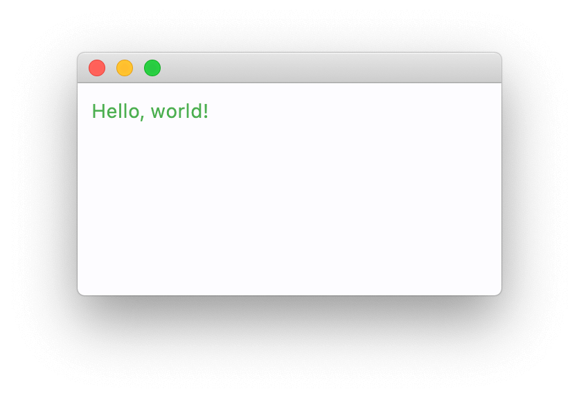
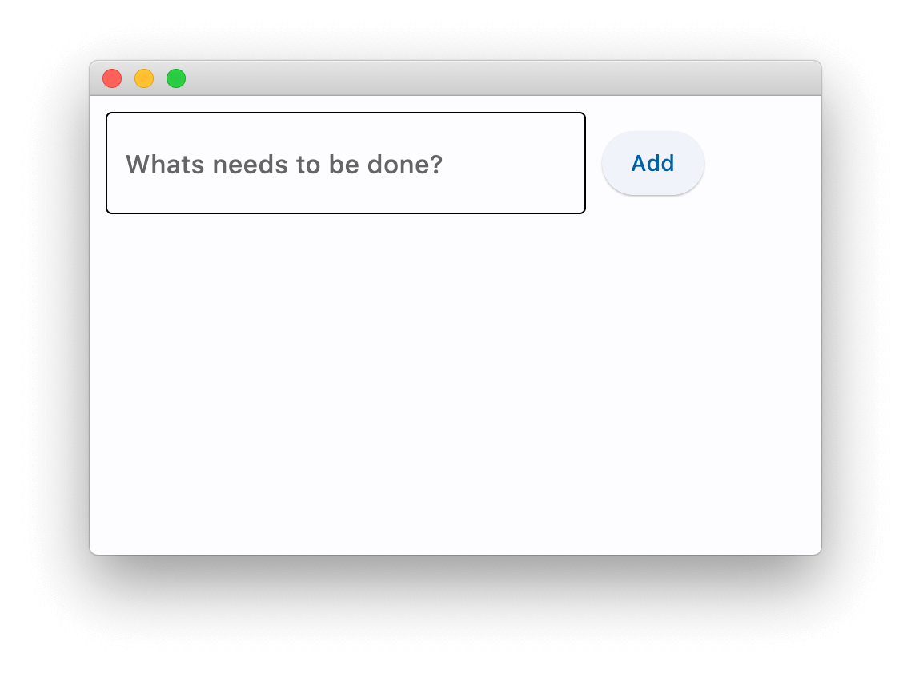
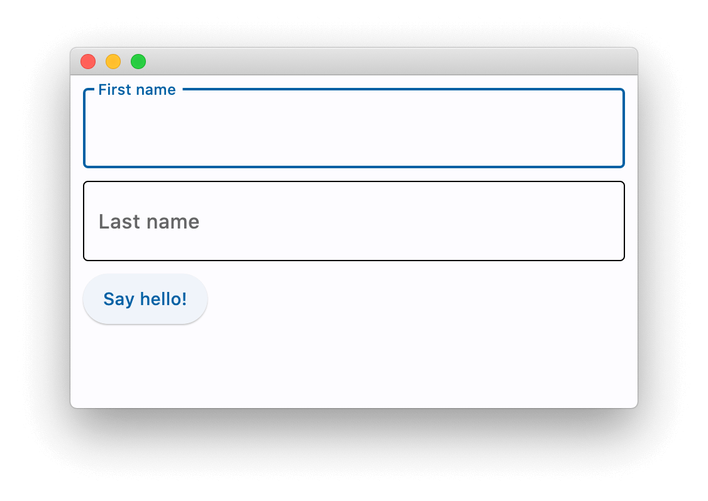
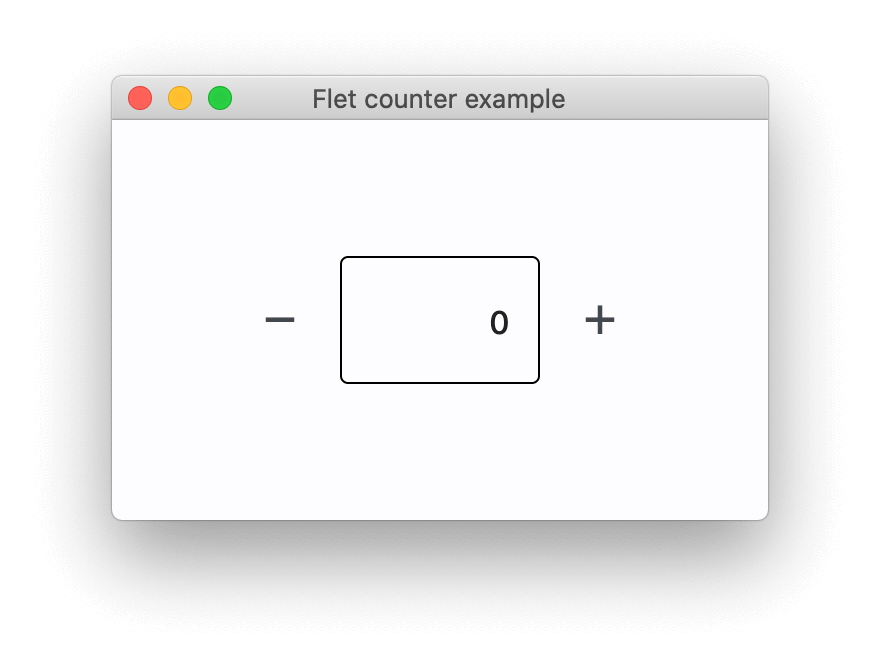
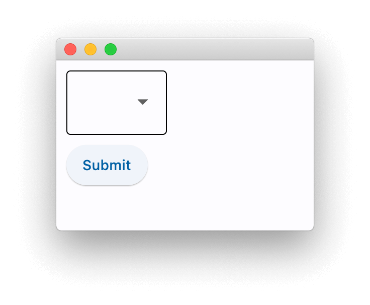
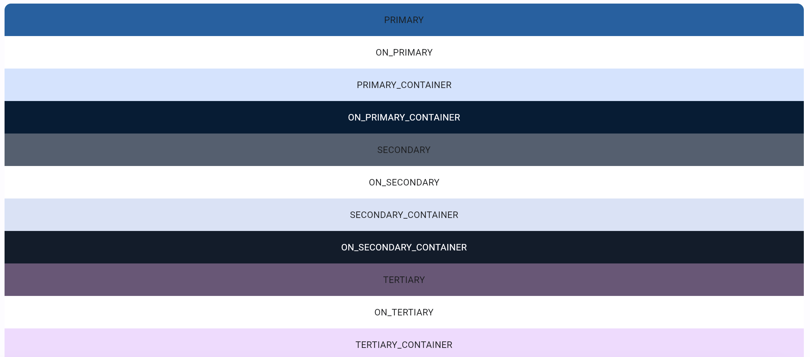

# Глава 1. Введение

## Что такое Flet?

Flet - это фреймворк, который позволяет создавать интерактивные многопользовательские веб-, настольные и мобильные приложения на  языке Python без предварительного опыта фронтэнд-разработки.

Вы создаете пользовательский интерфейс для своей программы с помощью элементов управления Flet, которые основаны на [Flutter](https://flutter.dev/) от Google. Flet не просто "оборачивает" виджеты Flutter, но добавляет собственное "мнение", комбинируя виджеты меньшего размера, скрывая сложности, внедряя лучшие практики пользовательского интерфейса, применяя разумные значения по умолчанию - все для того, чтобы ваши приложения выглядели круто и профессионально без дополнительных усилий.

## Пример приложения Flet

Вот пример приложения "Счетчик": `counter.py`

```python
import flet as ft

def main(page: ft.Page):
    page.title = "Flet counter example"
    page.vertical_alignment = ft.MainAxisAlignment.CENTER

    txt_number = ft.TextField(value="0", text_align=ft.TextAlign.RIGHT, width=100)

    def minus_click(e):
        txt_number.value = str(int(txt_number.value) - 1)
        page.update()

    def plus_click(e):
        txt_number.value = str(int(txt_number.value) + 1)
        page.update()

    page.add(
        ft.Row(
            [
                ft.IconButton(ft.icons.REMOVE, on_click=minus_click),
                txt_number,
                ft.IconButton(ft.icons.ADD, on_click=plus_click),
            ],
            alignment=ft.MainAxisAlignment.CENTER,
        )
    )

ft.app(target=main)
```

Для запуска приложения установите  модуль `flet`:

```
pip install flet
```

и запустите программу:

```
python counter.py
```

Приложение будет запущено в собственном окне операционной системы - какая приятная альтернатива Electron!


Если вы хотите запустить приложение как веб-приложение, просто замените последнюю строку на:

```python
ft.app(target=main, view=ft.AppView.WEB_BROWSER)
```

запустите еще раз, и теперь вы мгновенно получите веб-приложение:


# Глава 2. Создание Flet-приложений на Python

Чтобы написать Flet-приложение, вам не нужно быть гуру front-end, но рекомендуется обладать базовыми знаниями Python и объектно-ориентированного программирования.

В этом руководстве мы изучим структуру приложения Flet, узнаем, как выводить данные с помощью элементов управления Flet, запрашивать данные у пользователя и создавать базовые макеты страниц. Мы также рассмотрим некоторые варианты упаковки и развертывания, чтобы предоставить пользователям готовое приложение.

## Установка  модуля flet

Для Flet требуется Python версии 3.8 или выше. Чтобы начать с Flet, вам необходимо сначала установить  модуль `flet`:

```
pip install flet
```

> **ПРИМЕЧАНИЕ**
>
> Для обновления модуля `flet` запустите :
>
> ```
> pip install flet --upgrade
> ```

Чтобы установить предварительную версию Flet (для продвинутых пользователей), запустите:

```
pip install flet --pre
```

> **ВНИМАНИЕ**
>
> Рекомендуется устанавливать предварительные сборки в виртуальную среду.

## Базовая структура приложения

Самое минимальное приложение Flet имеет следующую структуру:

```python
import flet as ft

def main(page: ft.Page):
    # add/update controls on Page
    pass

ft.app(target=main)
```


> **ПРИМЕЧАНИЕ**
>
> Этот раздел намеренно назван "базовым", поскольку позже в этом руководстве мы рассмотрим более реальные подходы к структуре приложения с использованием повторно используемых элементов управления.

Типичная программа Flet заканчивается вызовом`flet.app()`, после чего приложение начинает ожидать новых сеансов пользователя. Функция `main()` - это точка входа в приложение Flet. Оно вызывается в новом потоке для каждого сеанса пользователя с  переданным в него экземпляром `Page`. При запуске Flet-приложения в браузере для каждой открытой вкладки или страницы запускается новый сеанс пользователя. При запуске в качестве настольного приложения создается только один сеанс.

`Page` это как "холст", специфичный для пользователя, визуальное состояние сеанса пользователя. Чтобы создать пользовательский интерфейс приложения, вы добавляете и удаляете элементы управления на страницу, обновляете их свойства. Приведенный выше пример кода будет отображать каждому пользователю только пустую страницу.

По умолчанию приложение Flet запускается в окне операционной системы, что очень удобно для разработки. Однако вы можете открыть его в новом окне браузера, изменив вызов `flet.app` следующим образом:

```python
ft.app(target=main, view=ft.AppView.WEB_BROWSER)
```

> **ИНФОРМАЦИЯ**
>
> Внутренне каждое приложение Flet является веб-приложением, и даже если оно открыто в окне операционной системы, встроенный веб-сервер все равно запускается в фоновом режиме. Веб-сервер Flet называется "Fletd" и по умолчанию он прослушивает случайный TCP-порт. Вы можете указать пользовательский TCP-порт, а затем открыть приложение в браузере вместе с режимом просмотра на рабочем столе:
>
> ```
> flet.app(port=8550, target=main)
> ```
>
> Откройте `http://localhost:<port>` в своем браузере, чтобы просмотреть веб-версию вашего приложения Flet.

## Элементы управления

Пользовательский интерфейс состоит из **элементов управления** (также известных как виджеты). Чтобы элементы управления были видны пользователю, они должны быть добавлены в `Page` или внутри других элементов управления. Page - самый верхний элемент управления. Вложенные элементы управления друг в друга могут быть представлены в виде дерева с Page в качестве корневого элемента.

Элементы управления - это обычные классы Python. Создавайте экземпляры элементов управления с помощью конструкторов с параметрами, соответствующими их свойствам, например:

```python
t = ft.Text(value="Hello, world!", color="green")
```

Чтобы отобразить элемент управления на странице, добавьте его в `page.controls`  и вызовите `page.update()` для отправки изменений страницы в браузер или настольный клиент:

```python
import flet as ft

def main(page: ft.Page):
    t = ft.Text(value="Hello, world!", color="green")
    page.controls.append(t)
    page.update()

ft.app(target=main)
```



> **ПРИМЕЧАНИЕ**
>
> В следующих примерах мы будем показывать только содержимое  функции `main`.

Вы можете изменять свойства элемента управления, и пользовательский интерфейс будет обновлен при следующей `page.update()`

```python
t = ft.Text()
page.add(t) # это короткая запись для вызова page.controls.append(t), 
		   # а затем page.update()

for i in range(10):
    t.value = f"Step {i}"
    page.update()
    time.sleep(1
```

Некоторые элементы управления являются "контейнерными" элементами управления (например, `Page`), которые могут содержать другие элементы управления. Например,  элемент управления `Row` позволяет размещать другие элементы управления в строке один за другим:

```python
page.add(
    ft.Row(controls=[
        ft.Text("A"),
        ft.Text("B"),
        ft.Text("C")
    ])
)
```

или `TextField` и `ElevatedButton` рядом:

```python
page.add(
    ft.Row(controls=[
        ft.TextField(label="Your name"),
        ft.ElevatedButton(text="Say my name!")
    ])
)
```

`page.update()` достаточно умен, чтобы отправлять только изменения, внесенные с момента его последнего вызова, поэтому вы можете добавить на страницу пару новых элементов управления, удалить некоторые из них, изменить свойства других элементов управления, а затем вызвать `page.update()` для выполнения пакетного обновления, например:

```python
for i in range(10):
    page.controls.append(ft.Text(f"Line {i}"))
    if i > 4:
        page.controls.pop(0)
    page.update()
    time.sleep(0.3)
```

Некоторые элементы управления, такие как кнопки, могут иметь обработчики событий, реагирующие на ввод данных пользователем, например `ElevatedButton.on_click`:

```python
def button_clicked(e):
    page.add(ft.Text("Clicked!"))

page.add(ft.ElevatedButton(text="Click me", on_click=button_clicked))
```

и более продвинутый пример:

```python
import flet as ft

def main(page):
    def add_clicked(e):
        page.add(ft.Checkbox(label=new_task.value))
        new_task.value = ""
        new_task.focus()
        new_task.update()

    new_task = ft.TextField(hint_text="Whats needs to be done?", width=300)
    page.add(ft.Row([new_task, ft.ElevatedButton("Add", on_click=add_clicked)]))

ft.app(target=main)
```



> **ИНФОРМАЦИЯ**
>
> Flet реализует *императивную* модель пользовательского интерфейса, в которой вы "вручную" создаете пользовательский интерфейс приложения с элементами управления с отслеживанием состояния, а затем изменяете его, обновляя свойства элемента управления. Flutter реализует *декларативную* модель, в которой пользовательский интерфейс автоматически перестраивается при изменении данных приложения. Управление состоянием приложения в современных интерфейсных приложениях по своей сути является сложной задачей, и "олдскульный" подход Flet мог бы быть более привлекательным для программистов без опыта работы с интерфейсом.

### Свойство `visible` 

Каждый элемент управления имеет свойство `visible` , которое `true` по умолчанию - элемент управления отображается на странице. Установка `visible` значения `false` полностью предотвращает отображение элемента управления (и всех его дочерних элементов, если таковые имеются) на холсте страницы. Скрытые элементы управления нельзя сфокусировать или выбрать с помощью клавиатуры или мыши, и они не генерируют никаких событий.

### Свойство  `disabled`

Каждый элемент управления имеет `disabled` свойство, которое по `false` умолчанию - элемент управления, и все его дочерние элементы включены. `disabled` свойство в основном используется с элементами управления для ввода данных, такими как `TextField`, `Dropdown`, `Checkbox`, кнопки. Однако, `disabled` может быть установлен у родительского элемента управления, и его значение будет рекурсивно передаваться всем дочерним элементам.

Например, если у вас есть форма с элементами управления с несколькими вводами, вы можете установить свойство `disabled`  для каждого элемента управления по отдельности:

```python
first_name = ft.TextField()
last_name = ft.TextField()
first_name.disabled = True
last_name.disabled = True
page.add(first_name, last_name)
```

или вы можете поместить элементы управления формой в контейнер, например, `Column` а затем установить `disabled` для всего столбца:

```python
first_name = ft.TextField()
last_name = ft.TextField()
c = ft.Column(controls=[
    first_name,
    last_name
])
c.disabled = True
page.add(c)
```

## Ссылки на элементы управления

Элементы управления Flet - это объекты, и для доступа к их свойствам нам нужно сохранить ссылки (переменные) на эти объекты.

Рассмотрим следующий пример:

```python
import flet as ft

def main(page):

    first_name = ft.TextField(label="First name", autofocus=True)
    last_name = ft.TextField(label="Last name")
    greetings = ft.Column()

    def btn_click(e):
        greetings.controls.append(ft.Text(f"Hello, {first_name.value} 
                                          		  {last_name.value}!"))
        first_name.value = ""
        last_name.value = ""
        page.update()
        first_name.focus()

    page.add(
        first_name,
        last_name,
        ft.ElevatedButton("Say hello!", on_click=btn_click),
        greetings,
    )
ft.app(target=main)
```


В самом начале `main()` метода мы создаем три элемента управления, которые собираемся использовать в `on_click` обработчике кнопки: два `TextField` для имени и фамилии и `Column` - контейнер для поздравительных сообщений. Мы создаем элементы управления со всеми их заданными свойствами, и в конце `main()` метода, при `page.add()` вызове, мы используем их ссылки (переменные).

Когда добавляется все больше элементов управления и обработчиков событий, становится сложно хранить все определения элементов управления в одном месте, поэтому они становятся разбросанными по `main()` телу. Взглянув на `page.add()` параметры, трудно представить (без постоянного перехода к определениям переменных в IDE), как будет выглядеть конечная форма:

```python
 page.add(
        first_name,
        last_name,
        ft.ElevatedButton("Say hello!", on_click=btn_click),
        greetings,
    )
```

Это `first_name` текстовое поле, установлена ли в нем авто-фокусировка? Приветствие - это `Row` или  `Column`?

Flet предоставляет `Ref` служебный класс, который позволяет определять ссылку на элемент управления, использовать эту ссылку в обработчиках событий и устанавливать ссылку на реальный элемент управления позже, при построении дерева. Идея исходит от [React](https://reactjs.org/docs/refs-and-the-dom.html).

Чтобы определить новую типизированную ссылку на элемент управления:

```python
first_name = ft.Ref[ft.TextField]()
```

Для доступа к элементу управления, на который есть ссылка (control de-reference), используйте `Ref.current` свойство:

```python
# empty first name
first_name.current.value = ""
```

Чтобы назначить управление ссылке, задайте для `Control.ref` свойства ссылку:

```python
page.add(
    ft.TextField(ref=first_name, label="First name", autofocus=True)
)
```

> **ПРИМЕЧАНИЕ**
>
> Все элементы управления Flet имеют `ref` свойство.

Мы могли бы переписать нашу программу, чтобы использовать ссылки:

```python
import flet as ft


def main(page):

    first_name = ft.Ref[ft.TextField]()
    last_name = ft.Ref[ft.TextField]()
    greetings = ft.Ref[ft.Column]()

    def btn_click(e):
        greetings.current.controls.append(
            ft.Text(f"Hello, {first_name.current.value} {last_name.current.value}!")
        )
        first_name.current.value = ""
        last_name.current.value = ""
        page.update()
        first_name.current.focus()

    page.add(
        ft.TextField(ref=first_name, label="First name", autofocus=True),
        ft.TextField(ref=last_name, label="Last name"),
        ft.ElevatedButton("Say hello!", on_click=btn_click),
        ft.Column(ref=greetings),
    )

ft.app(target=main)
```



Теперь мы можем четко видеть в `page.add()` структуру страницы и все элементы управления, из которых она построена.

Да, логика становится немного более подробной, поскольку вам нужно добавить `.current.` для доступа к элементу управления ref, но это вопрос личных предпочтений :)

# Глава 3. Получение данных от пользователя

Создание интерактивных веб-приложений с помощью Flet - это проще простого!

## Кнопка (Button)

`Button` это наиболее важный элемент управления вводом, который генерирует `click` событие при нажатии:

```python
btn = ft.ElevatedButton("Click me!")
page.add(btn)
```


Все события, генерируемые элементами управления на веб-странице, постоянно отправляются обратно в ваш скрипт, так как же вы реагируете на нажатие кнопки?

## Обработчики событий

 	Кнопки с событиями в приложении "Счетчик":

```python
import flet as ft

def main(page: ft.Page):
    page.title = "Flet counter example"
    page.vertical_alignment = ft.MainAxisAlignment.CENTER

    txt_number = ft.TextField(value="0", text_align="right", width=100)

    def minus_click(e):
        txt_number.value = str(int(txt_number.value) - 1)
        page.update()

    def plus_click(e):
        txt_number.value = str(int(txt_number.value) + 1)
        page.update()

    page.add(
        ft.Row(
            [
                ft.IconButton(ft.icons.REMOVE, on_click=minus_click),
                txt_number,
                ft.IconButton(ft.icons.ADD, on_click=plus_click),
            ],
            alignment=ft.MainAxisAlignment.CENTER,
        )
    )

ft.app(target=main)
```



## Текстовое поле (Textbox )

Flet предоставляет ряд элементов управления для построения форм: TextField], Checkbox, Dropdown, ElevatedButton.

Давайте спросим имя пользователя:

```python
import flet as ft

def main(page: ft.Page):
    page.title = "Flet counter example"
    page.vertical_alignment = ft.MainAxisAlignment.CENTER

    txt_number = ft.TextField(value="0", text_align="right", width=100)

    def minus_click(e):
        txt_number.value = str(int(txt_number.value) - 1)
        page.update()

    def plus_click(e):
        txt_number.value = str(int(txt_number.value) + 1)
        page.update()

    page.add(
        ft.Row(
            [
                ft.IconButton(ft.icons.REMOVE, on_click=minus_click),
                txt_number,
                ft.IconButton(ft.icons.ADD, on_click=plus_click),
            ],
            alignment=ft.MainAxisAlignment.CENTER,
        )
    )

ft.app(target=main)
```


## Флажок (Checkbox)

Элемент управления Checkbox предоставляет вам различные параметры для отправки свойств и событий для простоты использования.

Давайте создадим задачу с одним флажком:

```python
import flet as ft

def main(page):
    def checkbox_changed(e):
        output_text.value = (
            f"You have learned how to ski :  {todo_check.value}."
        )
        page.update()

    output_text = ft.Text()
    todo_check = ft.Checkbox(label="ToDo: Learn how to use ski", value=False, on_change=checkbox_changed)
    page.add(todo_check, output_text)

ft.app(target=main)
```


## Выпадающий список (Dropdown)

```python
import flet as ft


def main(page: ft.Page):
    def button_clicked(e):
        output_text.value = f"Dropdown value is:  {color_dropdown.value}"
        page.update()

    output_text = ft.Text()
    submit_btn = ft.ElevatedButton(text="Submit", on_click=button_clicked)
    color_dropdown = ft.Dropdown(
        width=100,
        options=[
            ft.dropdown.Option("Red"),
            ft.dropdown.Option("Green"),
            ft.dropdown.Option("Blue"),
        ],
    )
    page.add(color_dropdown, submit_btn, output_text)

ft.app(target=main)
```



# Глава 4.  Сочетания клавиш

Надежная поддержка клавиатуры является ключом к повышению производительности пользователя при использовании веб-сайта и, особенно, настольного приложения. Действительно, постоянное переключение между мышью и клавиатурой может быть действительно раздражающим.

В дополнение к `.autofocus` свойству и `TextField.focus()` методу элементов управления формой Flet позволяет обрабатывать "глобальные" события клавиатуры.

Чтобы фиксировать все нажатия клавиш, реализуйте `page.on_keyboard_event` обработчик. Параметр обработчика событий является экземпляром `e` класса со следующими свойствами:`KeyboardEvent`

- `key` - текстовое представление нажатой клавиши, например, `A`, `Enter` или `F5`.
- `shift` - `True` если нажата клавиша "Shift".
- `ctrl` - `True` если нажата клавиша "Control".
- `alt` - `True` если нажата клавиша "Alt" ("Option").
- `meta` - `True` если нажата клавиша "Command".

```python
import flet as ft  
  
def main(page: ft.Page):  
def on_keyboard(e: ft.KeyboardEvent):  
page.add(  
ft.Text(  
f"Key: {e.key}, Shift: {e.shift}, Control: {e.ctrl}, Alt: {e.alt}, Meta: {e.meta}"  
)  
)  
  
page.on_keyboard_event = on_keyboard  
page.add(  
ft.Text("Press any key with a combination of CTRL, ALT, SHIFT and META keys...")  
)  
  
ft.app(target=main)
```


# Глава 5. Цвета


## Значение цвета

Существует 2 способа определить значение свойства color в Flet: шестнадцатеричное значение и именованные цвета.

### Шестнадцатеричное значение

Шестнадцатеричное значение должно быть в формате `#aarrggbb` (`0xaarrggbb`) или `#rrggbb` (`0xeeggbb`). В случае, если параметр `aa` (непрозрачность) опущен, для него устанавливается значение `ff` (непрозрачный).

```
c1 = ft.Container(bgcolor='#ff0000')
```

### Именованные цвета

Именованные цвета - это цвета темы оформления материалов и палитры цветов. Их можно задать с помощью строкового значения или с помощью модуля flet.colors.

```
c1 = ft.Container(bgcolor=ft.colors.YELLOW)  
c2 = ft.Container(bgcolor='yellow')
```

#### Тематические цвета



В `theme.color_scheme` есть 30 именованных цветов темы, которые генерируются на основе свойства `color_scheme_seed`. Начальное значение цвета по умолчанию - "синий".

```python
# example for generating page theme colors based on the seed color  
page.theme = theme.Theme(color_scheme_seed='green')  
page.update()
```

Любой из 30 цветов может быть переопределен, и в этом случае они будут иметь абсолютное значение, которое не будет зависеть от начального цвета.

```python
page.theme = ft.Theme(
    color_scheme=ft.ColorScheme(
        primary=ft.colors.GREEN,
        primary_container=ft.colors.GREEN_200
        # ...
    ),
)
```


Цвета темы определяют резервные цвета для большинства элементов управления Flet.

#### Цветовые палитры


Первоначально созданные Material Design в 2014 году, цветовые палитры состоят из цветов, разработанных для гармоничного сочетания.

Образцы цветов (палитры) состоят из различных оттенков определенного цвета. Большинство образцов имеют оттенки от `100` до `900` с шагом в сто плюс цвет `50`. Чем меньше число, тем бледнее цвет. Чем больше число, тем темнее цвет. Образцы акцентов (например, `redAccent`) имеют только значения `100`, `200`, `400` и `700`.

Кроме того, доступна серия черных и белых цветов с обычной непрозрачностью. Например, `black54` - это чистый черный цвет с 54% непрозрачностью.

Цвета палитры можно использовать для настройки свойств цвета отдельных элементов управления или в качестве начального цвета для создания цветов темы.

## Непрозрачность цвета

Вы можете указать непрозрачность для любого цвета (шестнадцатеричное значение или именованный), используя `with_opacity` метод. Значение непрозрачности должно быть между `0.0` (полностью прозрачный) и `1.0` (непрозрачный).

```python
color = ft.colors.with_opacity(0.5, ft.colors.PRIMARY)
color = ft.colors.with_opacity(0.5, '#ff6666')
```

Другой способ указать непрозрачность для строкового значения:

```python
color = "surface,0.5"
```

Для шестнадцатеричного значения вы можете указать `aa` канал со значениями между `00` и `ff`, например:

```python
color = "#7fff6666"
```

## Определение цветов для элементов управления Flet

Большинство элементов управления Flet имеют цвета по умолчанию, определенные `color_scheme` которые могут быть переопределены на разных уровнях.


### Уровень контроля

Если цвет определен на уровне управления, он будет использоваться.

```python
c = ft.Container(width=100, height=100, bgcolor=ft.colors.GREEN_200)
```

Не у каждого элемента управления Flet есть свойство color, которое можно установить на уровне элемента управления. Например, `FilledButton` всегда имеет "основной" цвет по умолчанию, определяемый цветом ближайшего предка `theme`.

### Управление уровнем темы

Для `ScrollBar` (используется в элементах управления с возможностью прокрутки: `Page`, `View`, `Column`, `Row` `ListView`, `GridView` и `Tabs`), `Text` и [элементов управления, Flet проверит, есть ли в](https://flet.dev/blog/scrolling-controls-and-theming#nested-themes) ближайшей теме anscestor [задана](https://flet.dev/blog/scrolling-controls-and-theming#scrollbar-theme) тема полосы прокрутки[,](https://flet.dev/blog/scrolling-controls-and-theming#tabs-theming) тема вкладок [или](https://flet.dev/blog/scrolling-controls-and-theming#text-theming) текстовая тема, как указано в.

>ПРИМЕЧАНИЕ
>Если вам нужно изменить тему для определенного элемента управления полосой прокрутки, текстом или вкладками, вы можете поместить этот элемент управления в контейнер и настроить `scrollbar_theme`, `text_theme` или `tabs_theme` для этого контейнера `theme`.

### Уровень темы

Flet проверит наличие ближайшего предка, который `theme` определил, и возьмет цвет из `ColorScheme`. В приведенном ниже примере ближайшим параметром для `FilledButton` является `Container`, а `primary` цвет, который используется для кнопки, будет взят из `theme` цвета контейнера.

```python
import flet as ft

def main(page: ft.Page):          
    
    container = ft.Container(
        width=200,
        height=200,
        border=ft.border.all(1, ft.colors.BLACK),
        content=ft.FilledButton("Primary color"),
        theme=ft.Theme(color_scheme=ft.ColorScheme(primary=ft.colors.YELLOW)))
    
    page.add(container)

ft.app(target=main)   
```

Если свойство color элемента управления, тема для конкретного элемента управления или тема ближайшего предка не указаны, ближайшим предком будет страница, и будут использоваться цвета со страницы по умолчанию `color_scheme`.

#  Глава 6. Большие списки

